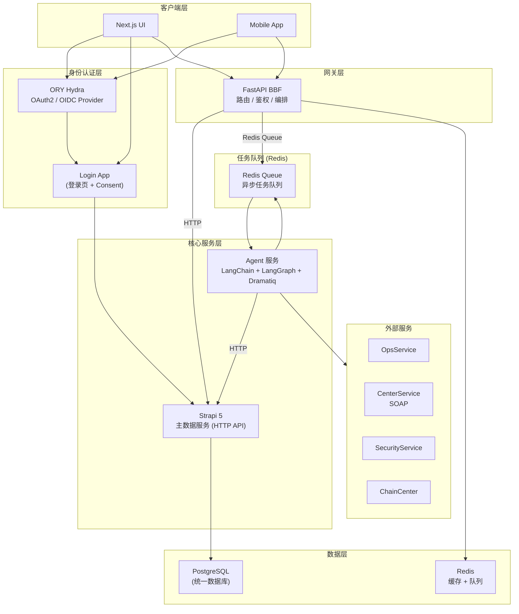

# ops-ng 系统总览

> 文档版本：v0.1 | 最后更新：2026-04-25 | 负责 Agent：Nick Fury

## 概述

ops-ng 是亚朵集团酒店运维管理系统的下一代版本，服务于负责产品运维的团队（运维人员与开发人员）。系统取代了原有的 .NET 单体应用 AutoDBSystem，当前阶段覆盖酒店与房型维护功能，排除订单与账务模块。整体采用前后端分离的微服务架构，通过标准 OAuth2/OIDC 协议统一认证鉴权。

## 功能说明

> 本节面向运维团队

### 功能列表

| 功能 | 说明 |
|------|------|
| 认证登录 | 通过 OAuth2 授权码流程完成统一登录，支持用户名密码方式，Token 自动刷新 |
| 酒店管理 | 查询、查看、修改酒店基本信息（名称、状态、归属等） |
| 房间管理 | 按酒店维度查询、管理具体房间信息及状态 |
| 房型管理 | 管理酒店房型配置，包括房型属性、价格策略等基础数据 |
| 批量任务执行 | 通过 Agent 服务触发并跟踪针对外部系统（OpsService、CenterService 等）的批量操作任务 |
| 任务状态查询 | 查询异步批量任务的执行进度与结果 |

### 操作流程

运维人员典型工作流如下：

1. 打开 ops-ng 前端页面，系统自动跳转至统一登录页
2. 输入用户名与密码完成身份验证，系统颁发访问令牌
3. 登录成功后进入主界面，通过搜索或列表找到目标酒店
4. 进入酒店详情页，查看酒店基本信息、房间列表、房型配置
5. 根据运维需求，修改相关字段并保存；若涉及批量操作，提交任务
6. 在任务列表中跟踪批量任务的执行状态，待完成后确认结果

### 注意事项

- 所有操作需持有有效的 OAuth2 访问令牌，令牌过期后需重新登录
- 权限基于角色分配，不同角色可操作的酒店范围与功能模块不同；请联系管理员确认权限
- 当前版本不涵盖订单与账务模块，相关操作请继续使用原有系统
- 批量任务为异步执行，提交后需在任务列表中查看最终结果，不可重复提交同一任务
- 对外部系统（OpsService、CenterService 等）的调用依赖网络连通性，若外部服务不可用，任务将进入等待或失败状态

## 技术设计

> 本节面向开发团队

### 组件职责

| 组件 | 技术 | 职责 |
|------|------|------|
| UI | Next.js + shadcn/ui | 前端用户界面，发起 OAuth2 授权流程，调用 BBF API |
| Login App | FastAPI / Next.js | 渲染登录页面，验证用户凭证，处理 Hydra Consent 回调 |
| ORY Hydra | Go 单二进制 | OAuth2 / OIDC 授权服务器，负责令牌颁发与验证，不存储用户数据 |
| FastAPI BBF | Python FastAPI | API 网关，负责路由、JWT 验证、服务编排、限流熔断、日志监控 |
| Strapi 5 | Node.js + PostgreSQL | 主数据服务，提供业务数据 CRUD API、用户管理、权限管理 |
| Agent 服务 | LangChain + LangGraph + Dramatiq | 后台批量任务执行引擎，编排工作流并调用外部服务 |
| Redis | Redis | 任务队列（Dramatiq）+ 缓存（Session / Token） |
| PostgreSQL | PostgreSQL | 统一业务数据库，存储所有业务与用户数据 |

### 关键接口 / API

| 接口 | 提供方 | 说明 |
|------|--------|------|
| `GET /oauth2/auth` | ORY Hydra | 发起 OAuth2 授权请求 |
| `POST /oauth2/token` | ORY Hydra | 获取 / 刷新访问令牌 |
| `GET /oauth2/userinfo` | ORY Hydra | 获取当前用户信息 |
| `POST /login` | Login App | 接收用户名密码，验证后回调 Hydra |
| `GET /api/hotels` | BBF → Strapi | 酒店列表查询 |
| `PUT /api/hotels/{id}` | BBF → Strapi | 酒店信息更新 |
| `POST /api/tasks` | BBF → Redis Queue | 提交异步批量任务 |
| `GET /api/tasks/{id}` | BBF → Strapi | 查询任务执行状态 |

### 数据流

**各层说明：**

- **客户端层**：Next.js UI 与 Mobile App，所有请求经由此层发起；OAuth2 授权流在此层触发
- **身份认证层**：ORY Hydra 负责令牌全生命周期管理；Login App 负责用户交互与凭证验证，调用 Strapi 确认用户身份后回调 Hydra
- **网关层**：FastAPI BBF 是唯一对外暴露的 API 入口，负责 Token 验证、路由分发、限流熔断
- **核心服务层**：Strapi 5 处理所有同步业务数据读写；Agent 服务处理需要编排多步骤的异步批量任务
- **任务队列**：Redis Queue 解耦 BBF 与 Agent，保障批量任务的可靠投递与异步执行
- **数据层**：PostgreSQL 统一存储所有业务数据；Redis 同时承担缓存与队列角色

### 依赖的外部服务

| 服务 | 协议 | 用途 |
|------|------|------|
| OpsService | HTTP | 运维操作相关的外部系统接口 |
| CenterService | SOAP | 中心系统数据同步 |
| SecurityService | HTTP | 安全相关服务 |
| ChainCenter | HTTP | 连锁中心数据服务 |

### 技术栈

| 组件 | 技术选型 | 说明 | 选型原因 |
|------|---------|------|----------|
| OAuth2 | **ORY Hydra** (Go) | 独立 OAuth2 / OIDC 服务 | 标准化认证协议，轻量 Go 单二进制，易于独立部署与维护 |
| Login App | FastAPI / Next.js | 登录页 + Consent | 与 Hydra 解耦，可独立迭代登录交互逻辑 |
| BBF | **FastAPI** | 网关 / 路由 / 鉴权 | Python 生态成熟，异步性能好，与 Agent 技术栈统一 |
| 主数据 | Strapi 5 + **PostgreSQL** | 内容管理 + 用户管理 | Content Types 开箱即用，减少重复 CRUD 开发工作量 |
| Agent | LangChain + LangGraph + Dramatiq | 后台批量任务执行 | LangGraph 支持复杂工作流编排，Dramatiq 提供可靠任务队列 |
| 任务队列 | Dramatiq + Redis | 异步任务队列 | 轻量稳定，与 Redis 缓存复用同一基础设施 |
| UI | Next.js + shadcn/ui | 前端 | SSR 支持好，shadcn/ui 组件质量高，开发效率高 |
| 数据库 | **PostgreSQL** (统一) | 所有业务数据 | 统一数据库降低运维复杂度，替代 legacy 的多 SQL Server 分散部署 |
| 缓存 | Redis | Session/Token 缓存 | 高性能，与任务队列共享部署，减少基础设施数量 |

## 与其他模块的关系

以下为 ops-ng 各模块文档索引：

| 文档编号 | 模块 | 说明 |
|----------|------|------|
| 01 | 认证与授权 | ORY Hydra OAuth2/OIDC 流程、Login App、Token 生命周期管理 |
| 02 | FastAPI BBF | API 网关设计、路由规则、JWT 验证、限流熔断策略 |
| 03 | Strapi 主数据服务 | Content Types 定义、用户管理、权限模型、CRUD API 规范 |
| 04 | Agent 服务 | 批量任务编排设计、LangGraph 工作流、Dramatiq 任务定义 |
| 05 | 酒店管理模块 | 酒店数据模型、查询与更新接口、与外部系统同步逻辑 |
| 06 | 房间管理模块 | 房间数据模型、状态机设计、运维操作接口 |
| 07 | 房型管理模块 | 房型配置数据模型、属性管理、与 CenterService 同步 |
| 08 | 任务队列与异步执行 | Redis Queue 设计、任务状态机、失败重试策略 |
| 09 | 部署与运维 | Docker Compose / K8s 部署方案、环境变量管理、监控告警 |

## 与 Legacy 系统的主要差异

| 维度 | Legacy (AutoDBSystem) | ops-ng |
|------|----------------------|--------|
| 架构风格 | .NET MVC 单体应用，所有功能集中在一个进程 | 微服务架构，各层独立部署、独立扩展 |
| 数据库 | 直接操作多个 SQL Server 数据库，跨库查询频繁 | 统一 PostgreSQL，通过 Strapi 提供标准化数据访问层 |
| 认证鉴权 | 无独立认证层，用户验证逻辑嵌入业务代码 | 独立 OAuth2/OIDC 认证服务（ORY Hydra），标准 Token 机制 |
| 前端交互 | 服务端渲染 MVC 页面，交互体验受限 | Next.js 现代前端，组件化开发，用户体验更佳 |
| 批量任务 | 业务逻辑与任务执行耦合，缺乏统一调度 | 独立 Agent 服务，LangGraph 工作流编排，支持任务状态追踪 |
| 可维护性 | 单体部署，局部修改需全量发布 | 各服务独立发布，降低变更风险，便于灰度上线 |
