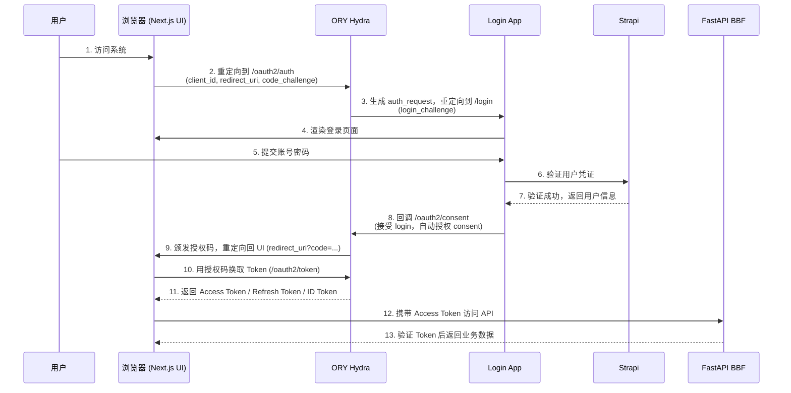

# 认证模块

> 文档版本：v0.1 | 最后更新：2026-04-25 | 负责 Agent：Black Widow

## 概述

认证模块基于标准 OAuth2/OIDC 授权码流程，由 ORY Hydra、Login App、Strapi 三个组件协同完成用户身份验证与令牌颁发。Hydra 作为授权服务器负责令牌生命周期管理，Login App 提供登录界面并调用 Strapi 验证用户凭证，Strapi 作为用户数据源。最终颁发的访问令牌由 BBF 网关校验后，允许客户端访问后端 API。

## 功能说明

> 本节面向运维团队

### 功能列表

- 用户登录：通过账号密码完成身份验证，获得访问令牌
- 用户登出：撤销当前令牌，终止登录会话
- Token 自动刷新：访问令牌过期前由客户端静默刷新，用户无感知
- 多设备登录：同一账号可在多设备同时登录，各设备持有独立令牌

### 操作流程

**登录**

1. 用户打开系统，浏览器自动跳转至登录页面
2. 输入账号和密码，点击登录
3. 系统验证通过后，自动跳转回主界面，获得访问权限

**登出**

1. 点击页面右上角"退出登录"按钮
2. 系统撤销当前令牌，跳转至登录页面

**Token 自动刷新**

- 系统在访问令牌过期前自动使用刷新令牌换取新的访问令牌
- 整个过程对用户透明，无需重新输入密码

### 注意事项

- **Token 有效期**：访问令牌（Access Token）有效期较短（建议 15 分钟～1 小时），刷新令牌（Refresh Token）有效期较长（建议 7～30 天）。刷新令牌过期后用户需重新登录。
- **多设备登录行为**：系统默认允许多设备同时在线，每台设备持有独立的令牌对。登出操作仅撤销当前设备的令牌，不影响其他设备的登录状态。
- **账号锁定**：若 Strapi 侧配置了登录失败限制，连续多次输入错误密码可能导致账号被临时锁定，需联系管理员处理。

## 技术设计

> 本节面向开发团队

### 组件职责

| 组件 | 在认证流程中的角色 |
|------|------------------|
| **ORY Hydra** | OAuth2/OIDC 授权服务器。负责生成授权请求（auth_request）、管理 Consent 流程、颁发 Access Token / Refresh Token / ID Token，以及处理令牌撤销。Hydra 本身不存储用户信息，用户验证逻辑完全委托给 Login App。 |
| **Login App** | 登录界面 + Consent 处理器。接收 Hydra 的登录回调，渲染登录表单，接收用户提交的凭证，调用 Strapi 验证用户身份，验证成功后将结果回调给 Hydra 完成 Consent 确认。可独立部署，与 Hydra 解耦。 |
| **Strapi** | 用户数据源。存储用户账号信息（用户名、密码哈希、角色权限等），为 Login App 提供用户凭证验证接口。Strapi 不直接参与 OAuth2 流程，仅在 Login App 调用时响应验证请求。 |

### 关键接口 / API

以下为 ORY Hydra 暴露的标准 OAuth2/OIDC Endpoints：

| Endpoint | 方法 | 用途 |
|----------|------|------|
| `/oauth2/auth` | GET | 授权请求入口。客户端（UI/Mobile）将用户重定向至此，携带 `client_id`、`redirect_uri`、`response_type=code`、`scope`、`code_challenge`（PKCE）等参数，启动授权码流程。 |
| `/oauth2/token` | POST | 令牌颁发端点。客户端用授权码（code）换取 Access Token、Refresh Token、ID Token；或使用 Refresh Token 换取新的 Access Token。 |
| `/oauth2/userinfo` | GET | 用户信息端点。携带有效 Access Token 可查询当前登录用户的基本信息（sub、name、email 等 OIDC 标准字段）。 |
| `/oauth2/revoke` | POST | 令牌撤销端点。登出时调用，撤销指定的 Access Token 或 Refresh Token，使其立即失效。 |

### 数据流

完整 OAuth2 授权码流程（9 步）：

> 注：上图步骤编号与本文"完整 OAuth2 授权码流程（9 步）"描述对应，其中步骤 6-7（Consent 自动授权）合并为单次 Login App → Hydra 回调，BBF 鉴权作为后置步骤展示。

### 依赖的外部服务

| 服务 | 依赖类型 | 说明 |
|------|---------|------|
| ORY Hydra | 强依赖 | 核心授权服务，不可用时整个登录流程中断 |
| Strapi | 强依赖 | 用户数据源，不可用时无法完成凭证验证 |
| PostgreSQL | 间接依赖 | Hydra 和 Strapi 均使用 PostgreSQL 持久化数据 |
| Redis | 可选依赖 | 用于 Session / Token 缓存，提升性能 |

---

> **已知风险 / 未决技术决策**
>
> Login App 技术选型尚未确定：
> - 方案 A：**FastAPI**（Python，后端渲染登录页，SSR）
> - 方案 B：**Next.js**（前端框架，与主 UI 技术栈统一，可复用组件）
>
> 两方案在部署复杂度、与现有团队技能栈的匹配程度上存在差异。在决策确定前，Login App 相关接口定义和部署方案暂不进入详细设计阶段。**此项为认证模块的已知风险，需在详细设计评审前明确。**

## 与其他模块的关系

- **BBF 网关模块**：BBF 负责校验每个 API 请求携带的 Access Token（通过 Hydra 的 JWKS 端点或 introspection 接口），鉴权通过后才将请求转发至 Strapi 或 Agent 服务。认证模块为 BBF 提供令牌验证的基础设施。
- **用户管理模块（Strapi）**：用户账号数据由 Strapi 管理，认证模块的 Login App 在验证用户凭证时直接调用 Strapi API。用户的角色与权限信息也通过 Strapi 下发，并可编码至 Token Claim 中供 BBF 做细粒度鉴权。
- **前端 UI 模块**：Next.js UI 负责发起 OAuth2 授权码流程，持有并刷新 Token，在所有 API 请求中附带 Authorization Header。

## 与 Legacy 系统的主要差异

| 维度 | Legacy 系统 | ops-ng 新系统 |
|------|------------|--------------|
| 登录方式 | 手机号 + 短信验证码 | 账号密码（标准 OAuth2/OIDC） |
| 验证码生成 | 由 EBusinessService 生成并下发短信 | 不依赖短信服务，无此组件 |
| 用户白名单 | 硬编码在 config 文件中 | 用户数据存储在 Strapi（数据库），支持动态管理 |
| 认证协议 | 私有实现 | 标准 OAuth2/OIDC，支持 PKCE 和 Refresh Token |
| 令牌机制 | 无标准令牌（Session 或自定义 Token） | 标准 JWT Access Token + Refresh Token |
| 多设备支持 | 依赖 Session，多设备行为不明确 | 每设备独立令牌对，行为标准化 |
| 可扩展性 | 新增登录方式需修改 EBusinessService | Login App 可独立扩展（如接入 SSO、MFA），不影响 Hydra |
