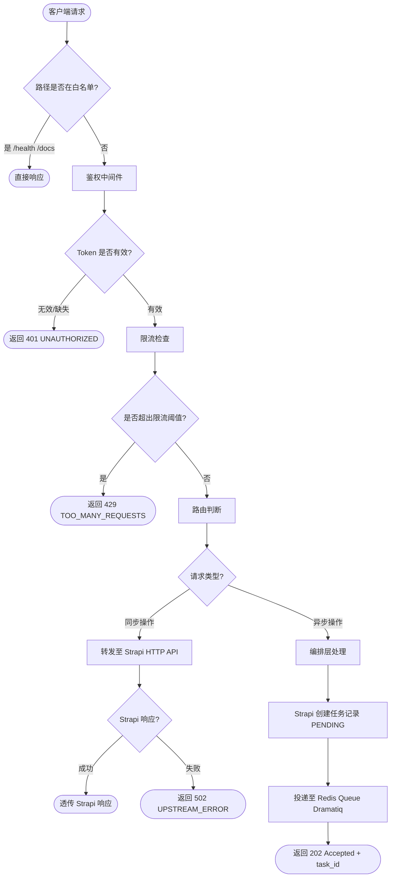
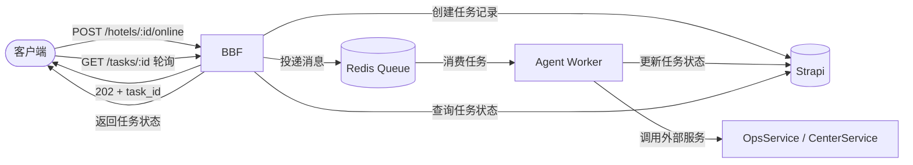

# BBF 网关

> 文档版本：v0.1 | 最后更新：2026-04-25 | 负责 Agent：Iron Man

## 概述

BBF（Backend for Backend）是 ops-ng 系统的统一 API 网关，基于 FastAPI 实现。所有来自 Next.js UI 和 Mobile App 的业务请求均经过 BBF 处理，由 BBF 负责身份验证、请求路由、服务编排、限流熔断和可观测性。

BBF 将请求分为两类路径：
- **同步路径**：直接转发至 Strapi 5 HTTP API，完成业务数据的增删改查
- **异步路径**：将任务投递至 Redis Queue（Dramatiq），由 Agent Worker 消费执行

BBF 本身不持有业务数据，不包含业务逻辑，是纯粹的网关与编排层。

---

## 功能说明

> 本节面向运维团队

### 功能列表

| 功能 | 描述 |
|------|------|
| 统一鉴权拦截 | 所有 API 请求必须携带有效 JWT Token，未登录请求将被拒绝 |
| 请求路由转发 | 根据请求路径和方法自动路由至 Strapi 或 Redis Queue |
| 异步任务投递 | 复杂业务操作（如酒店上线、批量房型修改）以异步方式投递队列 |
| 请求限流 | 基于 IP 或用户 ID 控制请求频率，防止系统过载 |
| 统一错误响应 | 所有错误均以标准 JSON 格式返回，便于前端统一处理 |
| 访问日志 | 记录每次请求的来源、路径、耗时和响应状态 |

### 操作流程

运维团队不直接操作 BBF，但 BBF 的运行状态直接影响系统可用性。以下是 BBF 保障的关键系统行为：

1. **未登录访问被拦截**：用户未携带有效 Token 访问任何 `/api/*` 接口时，BBF 返回 `401 UNAUTHORIZED`，前端将重定向用户至登录页面。

2. **请求频率过高被限流**：同一 IP 或用户 ID 在单位时间内超出请求阈值时，BBF 返回 `429 TOO_MANY_REQUESTS`，提示请求频率超限。

3. **系统异常统一格式返回**：当下游 Strapi 或 Redis 不可用时，BBF 捕获异常并以统一 JSON 格式返回 `503 SERVICE_UNAVAILABLE`，避免原始错误栈信息泄露。

4. **异步任务立即响应**：对于酒店上线等耗时操作，BBF 投递任务后立即返回 `202 Accepted` 和任务 ID，前端通过轮询或 WebSocket 获取最终状态。

### 注意事项

- Token 有效期由 ORY Hydra 配置决定，BBF 不延长或缩短 Token 有效期
- 异步任务一旦投入队列，即使 BBF 重启也不会丢失（由 Redis 持久化保障）
- BBF 无状态，可横向扩展，多实例共享同一 Redis 实例

---

## 技术设计

> 本节面向开发团队

### 组件职责

```
FastAPI BBF
├── 鉴权中间件 (AuthMiddleware)
│   ├── 提取 Authorization: Bearer <token>
│   ├── JWT 本地签名验证（性能优先模式）
│   └── 或调用 Hydra /oauth2/introspect（安全优先模式）
│
├── 路由层 (Router)
│   ├── /api/v1/hotels/*      → Strapi HTTP 转发
│   ├── /api/v1/hotels/:id/online → Redis Queue 投递
│   └── /api/v1/hotels/:id/rooms/* → Strapi / Redis Queue（按方法区分）
│
├── 编排层 (Orchestrator)
│   ├── 多步调用编排（如：先创建任务记录 → 再投递队列）
│   └── 任务 ID 生成与状态初始化
│
└── 限流层 (RateLimiter)
    ├── 基于 Redis 计数器实现滑动窗口限流
    └── 支持按 IP 或 user_id 维度限流
```

#### 鉴权中间件

鉴权中间件作为 FastAPI 的全局 Middleware 注册，在请求到达路由处理器前执行：

- 从请求头提取 `Authorization: Bearer <token>`
- 验证 JWT 签名和有效期
- 将解码后的用户信息（`user_id`、`roles`、`scopes`）注入 `request.state`，供下游路由使用
- 白名单路径（如 `/health`、`/docs`）跳过鉴权

**Token 验证策略权衡：**

| 策略 | 原理 | 优点 | 缺点 | 适用场景 |
|------|------|------|------|---------|
| JWT 本地验证 | 用 Hydra 公钥在本地验证签名和过期时间 | 无网络开销，延迟低（<1ms） | Token 撤销后仍需等到过期才失效 | 大多数业务接口（推荐默认） |
| Hydra Introspect | 每次请求调用 `/oauth2/introspect` | 实时感知 Token 撤销 | 增加约 10-30ms 延迟，Hydra 成为额外依赖 | 高安全敏感接口（如支付、权限变更） |

**推荐策略**：默认使用 JWT 本地验证；对少数高敏感接口（通过路由装饰器标注）调用 Hydra introspect。

#### 编排层

对于需要多步操作的业务（如酒店上线），编排层负责：

1. 验证请求参数和业务前置条件
2. 在 Strapi 中创建任务记录（状态：PENDING）
3. 将任务投递至 Redis Queue（Dramatiq）
4. 返回 `202 Accepted` 及任务 ID

#### 限流层

基于 Redis 实现滑动窗口限流：

- 默认规则：每用户每分钟 200 次请求
- 写操作规则：每用户每分钟 60 次
- 超限返回 `429 Too Many Requests`，响应头携带 `Retry-After`

### 关键接口 / API

#### 路由配置表

| 方法 | 路径 | 转发目标 | 响应类型 | 说明 |
|------|------|---------|---------|------|
| GET | /api/v1/hotels | Strapi | 同步 200 | 酒店列表查询 |
| POST | /api/v1/hotels | Strapi | 同步 201 | 新建酒店 |
| GET | /api/v1/hotels/:id | Strapi | 同步 200 | 酒店详情 |
| PUT | /api/v1/hotels/:id | Strapi | 同步 200 | 编辑酒店基础信息 |
| DELETE | /api/v1/hotels/:id | Strapi | 同步 204 | 删除酒店 |
| POST | /api/v1/hotels/:id/online | Redis Queue | 异步 202 | 酒店上线（触发 Agent 执行上线流程） |
| GET | /api/v1/hotels/:id/rooms | Strapi | 同步 200 | 房间列表 |
| POST | /api/v1/hotels/:id/rooms | Strapi | 同步 201 | 新增房间 |
| PATCH | /api/v1/hotels/:id/rooms | Redis Queue | 异步 202 | 批量修改房型（异步） |
| POST | /api/v1/hotels/:id/sync-room-types | Redis Queue | 异步 202 | 从外部系统同步房型（异步） |
| GET | /api/v1/tasks/:task_id | Strapi | 同步 200 | 查询异步任务执行状态 |

#### 统一错误响应格式

所有错误响应统一使用以下 JSON 结构：

```json
{
  "code": "UNAUTHORIZED",
  "message": "Token 已过期，请重新登录",
  "timestamp": "2026-04-25T10:30:00Z",
  "request_id": "req_abc123"
}
```

| 字段 | 类型 | 说明 |
|------|------|------|
| `code` | string | 机器可读的错误码（大写下划线命名） |
| `message` | string | 人类可读的错误描述 |
| `timestamp` | string | ISO 8601 格式的错误发生时间 |
| `request_id` | string | 请求唯一标识，用于日志追踪 |

常见错误码：

| HTTP 状态码 | code | 触发场景 |
|------------|------|---------|
| 401 | `UNAUTHORIZED` | Token 缺失或已过期 |
| 403 | `FORBIDDEN` | Token 有效但无权限 |
| 429 | `TOO_MANY_REQUESTS` | 请求频率超出限制 |
| 502 | `UPSTREAM_ERROR` | Strapi 返回异常 |
| 503 | `SERVICE_UNAVAILABLE` | 下游服务不可达 |

### 数据流

#### 请求处理完整流程



#### 异步任务完整生命周期



### 依赖的外部服务

| 服务 | 协议 | 用途 | 失败处理策略 |
|------|------|------|------------|
| ORY Hydra | HTTP (JWKS endpoint) | 获取公钥用于 JWT 本地验证；高敏感接口 token introspect | JWKS 公钥本地缓存，Hydra 短暂不可用不影响本地验证 |
| Strapi 5 | HTTP REST | 业务数据读写、任务状态管理 | 返回 502，记录错误日志，不重试（幂等性由调用方保障） |
| Redis | Redis Protocol | 任务队列投递（Dramatiq）、限流计数器、Token 黑名单 | Redis 不可用时异步接口降级为 503，同步接口不受影响 |

---

## 与其他模块的关系

```
Next.js UI ─────┐
                ├──→ BBF ──→ Strapi 5 (同步 CRUD)
Mobile App ─────┘     └──→ Redis Queue → Agent Worker → 外部服务
                              ↑
                         ORY Hydra (Token 验证)
```

- **与 ORY Hydra 的关系**：BBF 消费 Hydra 颁发的 JWT Token，通过 JWKS 端点获取公钥进行本地验证。BBF 不参与 Token 颁发流程。

- **与 Strapi 5 的关系**：BBF 是 Strapi 的唯一直接调用方（UI 不直接访问 Strapi）。BBF 透传大多数请求，仅在编排场景下进行多步调用。

- **与 Agent 服务的关系**：BBF 通过 Redis Queue（Dramatiq）与 Agent 解耦。BBF 只负责投递，不关心 Agent 的执行细节。任务状态由 Agent 回写 Strapi，BBF 从 Strapi 查询后返回给客户端。

- **与 Redis 的关系**：BBF 使用 Redis 作为限流计数器存储和 Dramatiq 消息代理，不直接持久化业务数据到 Redis。

---

## 与 Legacy 系统的主要差异

| 维度 | Legacy 系统 | ops-ng BBF |
|------|------------|-----------|
| 网关层 | 无独立网关，.NET Controller 直接处理请求 | 独立 FastAPI 网关，所有请求统一入口 |
| 鉴权机制 | 各 Controller 自行处理鉴权，逻辑分散 | 统一鉴权中间件，一处配置全局生效 |
| 外部服务调用 | .NET Controller 直接调用 OpsService | BBF 投递队列，Agent Worker 异步执行，主链路不阻塞 |
| 错误格式 | 各接口错误格式不统一，前端需逐一适配 | 统一错误响应格式，前端只需一套错误处理逻辑 |
| 限流能力 | 无请求限流，依赖 IIS/Nginx 层粗粒度控制 | 基于 Redis 的用户级滑动窗口限流 |
| 可观测性 | 日志分散在各服务，无统一 request_id | 统一请求日志，全链路 request_id 追踪 |
| 水平扩展 | 有状态，扩展复杂 | 无状态设计，可直接水平扩展 |
