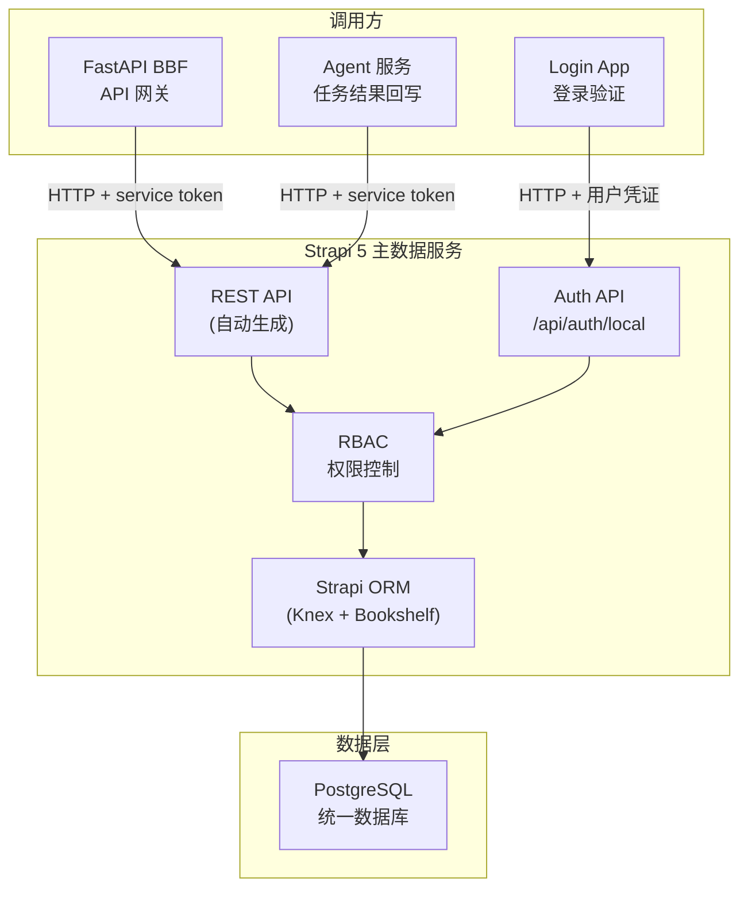

# Strapi 主数据服务

> 文档版本：v0.1 | 最后更新：2026-04-25 | 负责 Agent：Thor

---

## 概述

Strapi 5 是 ops-ng 系统的主数据服务，承担酒店、房间、房型、用户等核心业务数据的统一管理职责。它通过 Strapi 内置的 Content-Type Builder 定义数据模型，自动生成 REST API，供 BBF 网关、Login App 及 Agent 服务调用。所有数据持久化至统一 PostgreSQL 数据库，由 Strapi ORM 层封装，上层服务不直接执行 SQL。

---

## 功能说明

> 本节面向运维团队

### 功能列表

| 功能模块 | 说明 |
|---------|------|
| 酒店数据维护 | 支持酒店的新增、编辑、查询；运维人员通过前端 UI 操作，由 BBF 转发至 Strapi |
| 房间数据维护 | 管理各酒店下的具体房间信息，包括房号、楼层、所属房型 |
| 房型数据维护 | 查询、同步房型；Agent 完成房型同步任务后回写至 Strapi |
| 用户账号管理 | 维护运营人员账号；Login App 在登录流程中调用 Strapi 验证用户凭证 |
| 权限管理 | 通过 Strapi 内置 RBAC 控制不同角色对数据的读写权限 |

### 操作流程

**酒店数据维护流程：**

1. 运维人员通过前端 UI 操作酒店数据
2. 前端发起 HTTP 请求至 BBF 网关
3. BBF 携带 service token 调用 Strapi REST API
4. Strapi 写入 PostgreSQL 并返回结果

**用户登录验证流程：**

1. 用户在 Login App 提交账号凭证
2. Login App 调用 Strapi 验证 email/mobile + password
3. 验证成功后 Login App 回调 ORY Hydra
4. Hydra 颁发 OAuth2 Token，用户完成登录

**房型同步流程：**

1. BBF 将同步任务投递至 Redis 队列
2. Agent Worker 消费任务
3. Agent 调用外部 OpsService/CenterService 获取最新房型数据
4. Agent 通过 HTTP 将房型数据回写至 Strapi
5. Strapi 持久化至 PostgreSQL

### 注意事项

- 运维人员不直接访问 Strapi 管理后台（Admin Panel），所有数据操作通过前端 UI 完成。
- Strapi Admin Panel 仅供开发/系统管理员使用，用于模型变更和系统配置。
- API Token 或 service token 需妥善保管，不得在前端代码中明文暴露。
- 房型同步为全量替换操作（对应 legacy 的 DELETE + INSERT），执行前需确认 Agent 任务状态。

---

## 技术设计

> 本节面向开发团队

### 组件职责

| 组件 | 职责 |
|-----|------|
| Content-Type Builder | 定义 Hotel、Room、RoomType、User 等数据模型 |
| REST API (自动生成) | 为每个 Content Type 自动生成 CRUD 端点 |
| Users & Permissions 插件 | 管理用户账号、角色、JWT 认证 |
| RBAC | 控制 BBF、Login App、Agent 等调用方的接口访问权限 |
| Strapi ORM (Knex + Bookshelf) | 统一封装 PostgreSQL 数据访问，禁止外部直接执行 SQL |

### Content Types 定义

#### Hotel（对应 legacy c_chain 表）

| Strapi 字段 | 类型 | legacy 字段 | 说明 |
|------------|------|------------|------|
| chainId | Integer | ChainID | 酒店编码（业务主键） |
| chainName | String | ChainName | 酒店名称 |
| dbName | String | DBName | legacy 分库名称（迁移期保留） |
| address | String | ChainAddress | 酒店地址 |
| telephone | String | Telephone | 电话 |
| fax | String | Fax | 传真 |
| cityId | Integer | CityID | 城市 ID |
| areaId | Integer | AreaID | 区域 ID |
| postCode | String | PostCode | 邮编 |
| remark | Text | Remark | 备注 |
| product | Integer | Product | 产品类型 |
| isGuide | Integer | IsGuide | 是否导引 |
| status | Integer | Status | 状态（1-2 未上线，3 正常，4 关闭） |
| step | Integer | Step | 开店步骤 |
| openDate | DateTime | OpenDate | 开业日期 |
| instance | String | Instance | FO 实例别名 |

#### Room

| 字段 | 类型 | 说明 |
|-----|------|------|
| roomId | Integer | 房间 ID（业务主键） |
| chainId | Integer | 所属酒店 ID（关联 Hotel） |
| roomNo | String | 房间号 |
| roomTypeCode | String | 房型代码（关联 RoomType） |
| floor | Integer | 楼层 |

#### RoomType

| 字段 | 类型 | 说明 |
|-----|------|------|
| roomTypeId | Integer | 房型 ID（业务主键） |
| roomTypeName | String | 房型名称 |
| roomTypeCode | String | 房型代码（唯一标识） |
| bedCount | Integer | 床位数 |
| maxCheckInCount | Integer | 最大入住人数 |
| sort | Integer | 排序权重 |

#### User（由 Strapi Users & Permissions 插件提供）

| 字段 | 类型 | 说明 |
|-----|------|------|
| email | Email | 邮箱（登录凭证之一） |
| mobile | String | 手机号（扩展字段，登录凭证之一） |
| password | Password | 密码（bcrypt 加密存储） |
| role | Relation | 角色（关联 Role 表，RBAC） |
| confirmed | Boolean | 账号是否已激活 |
| blocked | Boolean | 账号是否被封禁 |

### 关键接口 / API

| 方法 | 端点 | 调用方 | 说明 |
|------|------|-------|------|
| POST | `/api/auth/local` | Login App | 用户登录验证，返回 JWT |
| GET | `/api/hotels` | BBF | 查询酒店列表，支持过滤/分页 |
| GET | `/api/hotels/:id` | BBF | 查询单个酒店详情 |
| POST | `/api/hotels` | BBF | 新增酒店 |
| PUT | `/api/hotels/:id` | BBF | 编辑酒店信息 |
| GET | `/api/rooms` | BBF | 查询房间列表 |
| GET | `/api/room-types` | BBF / Agent | 查询房型列表 |
| PUT | `/api/room-types/:id` | Agent | Agent 回写房型同步结果 |
| POST | `/api/room-types` | Agent | Agent 新增房型记录 |
| GET | `/api/users/me` | Login App | 获取当前用户信息（JWT 认证） |

### 数据流

### 权限控制

- **公开接口**：无，所有接口均需认证。
- **BBF 调用**：使用 Strapi API Token（service token），通过请求头 `Authorization: Bearer <token>` 传递。
- **Login App 调用**：`/api/auth/local` 端点使用用户名密码认证，返回短期 JWT。
- **Agent 调用**：使用独立 API Token，仅授权 RoomType 写入权限，最小权限原则。
- **RBAC 配置**：在 Strapi Admin Panel 的 Settings > Roles 中配置各 token 的权限范围。

### 依赖的外部服务

| 服务 | 类型 | 说明 |
|-----|------|------|
| PostgreSQL | 数据库 | 所有 Content Type 数据持久化 |
| ORY Hydra | OAuth2 Provider | Login App 验证成功后回调 Hydra |
| Redis | 缓存 | BBF 层缓存（Strapi 本身不直接依赖 Redis） |

---

## 与其他模块的关系

| 模块 | 与 Strapi 的关系 |
|-----|----------------|
| FastAPI BBF | BBF 是 Strapi 的主要消费方，负责酒店/房间数据的 CRUD 操作；BBF 使用 service token 鉴权 |
| Login App | Login App 调用 Strapi Auth API 验证用户凭证，是用户身份的唯一数据来源 |
| ORY Hydra | Hydra 不直接访问 Strapi；通过 Login App 间接使用 Strapi 的用户数据 |
| Agent 服务 | Agent 在完成房型同步等后台任务后，通过 HTTP 回写数据至 Strapi |
| Next.js UI | UI 不直接调用 Strapi；所有请求经由 BBF 路由 |

---

## 与 Legacy 系统的主要差异

| 维度 | Legacy 系统 | ops-ng (Strapi 5) |
|-----|------------|-------------------|
| 数据访问方式 | 直接拼接 SQL 字符串执行（存在 SQL 注入风险，如 `ChainName like '%` + ChainName + `%'`） | Strapi ORM 封装，参数化查询，无 SQL 注入风险 |
| 数据库架构 | 多库分散：AutoDB 存 c_chain，FO 分库存 r_Room/r_RoomType，CC 库，BI 库 | 统一 PostgreSQL 单库，所有数据集中管理 |
| 数据同步 | 跨多库手动同步（如 UpdateChainNameCC、UpdateChainNameFo），存在双写状态机 | 单一数据源，无需跨库同步 |
| 房型同步 | Agent 直接向各 FO 分库执行 DELETE + INSERT SQL | Agent 调用 Strapi REST API，由 ORM 层写入统一库 |
| 用户管理 | 分散在各子系统，无统一用户数据层 | 由 Strapi Users & Permissions 插件统一管理 |
| API 层 | 无统一 API 层，各模块直接操作数据库 | Strapi 自动生成标准 REST API，统一入口 |
| 权限控制 | 代码层硬编码，缺乏统一权限模型 | Strapi RBAC，细粒度权限配置，可视化管理 |
| 迁移过渡 | `DBName` / `Instance` 字段标识 legacy 分库 | `dbName` / `instance` 字段保留，供迁移期数据对照使用 |
