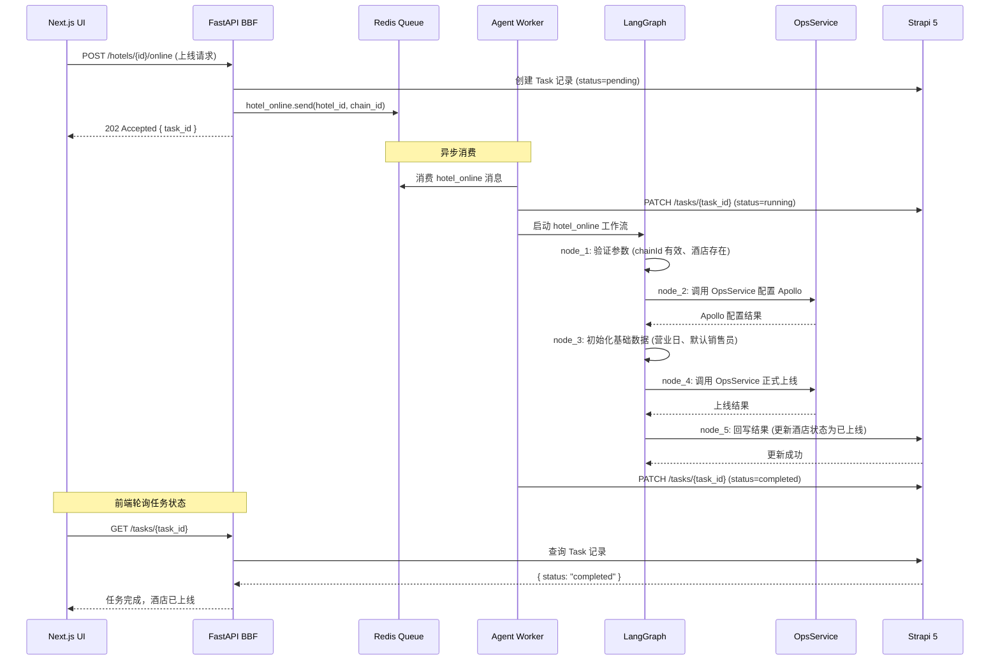

# Agent 服务

> 文档版本：v0.1 | 最后更新：2026-04-25 | 负责 Agent：Doctor Strange

---

## 概述

Agent 服务是 ops-ng 系统的后台批量任务执行引擎，负责处理耗时较长、需要多步编排的业务操作（如酒店上线、房型同步等）。其核心设计理念是将这些操作从同步请求链路中解耦，通过异步任务队列驱动执行，由 LangGraph 管理有状态的多步工作流。

技术栈：**LangChain + LangGraph + Dramatiq + Redis**

---

## 功能说明

> 本节面向运维团队

### 功能列表

| 功能 | 描述 |
|------|------|
| 酒店上线 | 点击上线按钮后，系统自动依次完成参数验证、Apollo 配置、基础数据初始化、正式上线、结果回写等操作 |
| 房型同步 | 从 ChainCenter 拉取最新房型数据并更新至系统 |
| 任务状态查询 | 随时查看任务的当前执行状态和失败原因 |

### 操作流程

以酒店上线为例：

1. 运维人员在 UI 上点击目标酒店的「上线」按钮
2. 系统提示「任务已提交，正在后台执行」，并返回任务 ID
3. 运维人员可在任务列表页查看该任务的实时状态
4. 任务完成后，酒店状态自动更新为「已上线」；若失败，页面显示具体失败原因

**任务状态说明：**

| 状态 | 含义 |
|------|------|
| 待执行 | 任务已提交，等待 Worker 消费 |
| 执行中 | Worker 正在执行工作流节点 |
| 完成 | 所有节点执行成功，结果已回写 |
| 失败 | 某节点执行失败，含失败原因和已重试次数 |

### 注意事项

- 酒店上线任务不可重复提交：同一酒店若存在执行中的上线任务，再次提交将被拒绝
- 任务失败时系统自动重试最多 3 次，全部失败后才置为「失败」状态
- 任务执行状态可通过任务列表页或任务 ID 接口随时查询

---

## 技术设计

> 本节面向开发团队

### 组件职责

| 组件 | 职责 |
|------|------|
| **Dramatiq** | 任务定义、任务投递、重试策略声明 |
| **Redis Queue** | 任务消息持久化，作为 Dramatiq 的消息代理（broker） |
| **Agent Worker** | Dramatiq Worker 进程，消费 Redis 队列，驱动 LangGraph 工作流执行 |
| **LangGraph** | 有状态的工作流引擎，管理多步任务节点的执行顺序和状态流转 |

### 关键接口 / API

**任务列表（由 BBF 投递至 Dramatiq）：**

| 任务名 | 触发方 | 说明 |
|--------|--------|------|
| `hotel_online` | BBF（酒店上线操作） | 执行酒店上线完整流程 |
| `sync_room_types` | BBF（房型同步操作） | 从 ChainCenter 同步最新房型数据 |

**BBF 投递任务示例（内部调用，非对外 API）：**

```python
# BBF 内部调用 Dramatiq 投递任务
hotel_online.send(hotel_id=123, chain_id="ABC", operator="admin")
```

**任务状态回调（Agent → Strapi HTTP）：**

```
PATCH /api/tasks/{task_id}
Body: { "status": "completed" | "failed", "result": {...}, "error": "..." }
```

### 数据流

以下时序图描述酒店上线任务的完整异步生命周期：



**酒店上线 LangGraph 工作流节点说明：**

| 节点 | 名称 | 操作 |
|------|------|------|
| node_1 | 参数验证 | 校验 chainId 有效性、确认酒店记录存在 |
| node_2 | 配置 Apollo | 调用 OpsService，完成 Apollo 参数下发 |
| node_3 | 初始化基础数据 | 设置营业日、增加默认销售员（原 InitData 逻辑） |
| node_4 | 正式上线 | 调用 OpsService 执行上线（含上线 SQL、同步 APP 信息、推送开业消息） |
| node_5 | 回写结果 | HTTP 调用 Strapi，更新酒店状态为已上线 |

**幂等性与重试策略：**

- 每个任务实例拥有唯一 `task_id`（UUID），重复投递同一任务 ID 将被 Dramatiq 忽略
- 任务失败后自动重试，最多重试 **3 次**，重试间隔采用**指数退避**策略（1s、2s、4s）
- 全部重试耗尽后任务状态置为 `failed`，并记录最后一次失败原因

### 依赖的外部服务

> **风险提示：以下外部服务接口的详细规范（请求格式、字段定义、错误码）尚未文档化，属于已知风险，需在实现阶段与相关团队确认。**

| 服务 | 协议 | 调用场景 | 接口规范状态 |
|------|------|----------|------------|
| OpsService | HTTP | 酒店上线 / Apollo 配置 / 下线操作 | **待补充** |
| CenterService | SOAP | 数据库连接字符串获取 | **待补充** |
| ChainCenter | HTTP | 房型数据同步 | **待补充** |

---

## 与其他模块的关系

```
Next.js UI
    │
    ▼
FastAPI BBF ──────────────────────────────────────┐
    │                                             │
    │ HTTP                               Redis Queue (Dramatiq)
    ▼                                             │
Strapi 5 (任务状态持久化)            Agent Worker (消费队列)
    ▲                                             │
    │ HTTP (结果回写)                    LangGraph 工作流
    └─────────────────────────────────────────────┘
```

- **BBF**：任务的发起方，负责鉴权后将任务投递到 Redis Queue
- **Strapi 5**：任务状态的持久化存储，Agent 执行完毕后通过 HTTP 回写结果
- **Redis**：既是 Dramatiq 的消息代理（broker），也是任务结果的临时存储后端
- **前端 UI**：通过轮询 BBF 接口查询任务状态，感知任务完成

---

## 与 Legacy 系统的主要差异

| 维度 | Legacy (HomeController.cs) | 新系统 (Agent 服务) |
|------|--------------------------|-------------------|
| 执行模式 | HTTP 请求中同步调用 OpsService，阻塞等待响应 | 异步队列解耦，立即返回 task_id |
| 状态追踪 | 无任务状态概念，成功/失败仅靠 HTTP 响应码判断 | 任务状态持久化到 Strapi，可随时查询 |
| 失败处理 | 失败后无重试，需运维手动重新触发 | 自动重试最多 3 次，指数退避，失败原因记录 |
| 流程管理 | 3 步流程（ConfigApollo → InitData → OnLine）硬编码在 Controller 方法中 | LangGraph 节点化管理，每步状态独立可观测 |
| 可维护性 | 流程逻辑、错误处理、外部调用混杂在同一方法中 | 工作流、任务调度、外部服务调用分层解耦 |
| 并发能力 | 受 Web Server 线程池限制 | Worker 可独立扩容，不影响 API 服务 |
