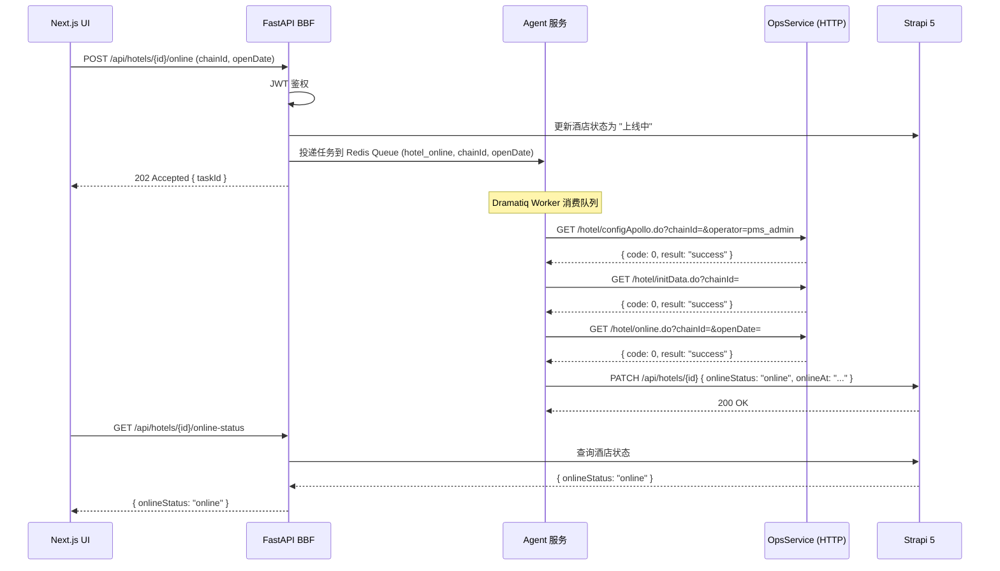

# 酒店管理

> 文档版本：v0.1 | 最后更新：2026-04-25 | 负责 Agent：Captain America

---

## 概述

酒店管理模块负责亚朵 PMS 系统中酒店（门店）数据的全生命周期管理，涵盖酒店信息录入、编辑、改名，以及上线/下线的完整操作流程。

在新系统架构中，所有请求统一通过 FastAPI BBF 网关进入；简单的 CRUD 操作由 BBF 直接路由至 Strapi 5 完成；涉及多系统协调的复杂流程（如酒店上线三步流程）则通过 Redis 任务队列投递给 Agent 服务异步执行，最终结果回写 Strapi。

---

## 功能说明

> 本节面向运维团队

### 功能列表

| 功能 | 操作入口 | 说明 |
|------|---------|------|
| 酒店列表 | 主页 / 酒店管理列表页 | 显示所有已录入酒店，支持按名称搜索筛选 |
| 按名称搜索 | 列表页搜索框 | 输入关键词后实时返回匹配酒店名称列表 |
| 新建酒店 | 列表页「新建」按钮 | 填写酒店基本信息并上传房间 Excel 文件完成创建 |
| 编辑酒店 | 列表页「编辑」操作 | 修改酒店可变信息；ChainID、ChainName、DBName 不可修改 |
| 酒店改名 | 列表页「改名」操作 | 修改酒店名称，系统自动同步到多个下游服务 |
| 酒店上线（第一步）| 操作页「配置 Apollo」按钮 | 配置 PMS Apollo 参数 |
| 酒店上线（第二步）| 操作页「初始化数据」按钮 | 初始化房间、营业日、默认销售员等数据 |
| 酒店上线（第三步）| 操作页「正式上线」按钮 | 执行上线脚本，推送开业通知 |
| 酒店下线 | 操作页「下线」按钮 | 将酒店状态切换为下线，停止对外接受预订 |
| 初始化营业日 | 操作页「初始化营业日」按钮 | 重新设置营业日，同步合并库数据 |
| 执行 Job | 操作页「执行 Job」按钮 | 手动触发 initRoomStatusTask、initRoomInventoryTask、syncMappingTask |

### 操作流程

#### 新建酒店

1. 进入「新建酒店」页面，系统自动加载可用酒店列表与区域列表（来自 OpsService）。
2. 填写酒店基本信息：ChainID（从列表选择）、地址、电话、传真、区域、城市、邮编、酒店类型、是否直营、描述、开业日期。
3. 上传房间数据 Excel 文件（.xls 或 .xlsx 格式）；文件列依次为：楼层、房间号（4 位数字）、房型编码。
4. 提交后系统解析 Excel、校验数据，通过后将酒店信息与房间数据写入。

#### 酒店上线操作流程（重点）

上线流程分为三个独立步骤，**必须按顺序依次执行，每步成功后方可进行下一步**。

**第一步：配置 Apollo**

- 在操作页点击「配置 Apollo」。
- 系统调用 OpsService 的 `configApollo` 接口，以 `pms_admin` 身份配置该酒店对应的 Apollo 命名空间。
- 成功后界面提示「配置成功」，方可执行第二步。

**第二步：初始化数据**

- 点击「初始化数据」。
- 系统调用 OpsService 的 `initData` 接口，完成以下子步骤（由 OpsService 内部串行执行）：
  - 将房间数据写入酒店分库。
  - 设置营业日。
  - 创建默认销售员（写入 CC 库）。
  - 配置 CC 库酒店参数。
  - 在 BI 库创建分店记录。
- 成功后方可执行第三步。

**第三步：正式上线**

- 点击「正式上线」，需提供开业日期（OpenDate）。
- 系统调用 OpsService 的 `online` 接口，执行上线脚本，并推送开业消息至酒店生命周期系统和特许平台。
- 上线成功后酒店状态变为在线，开始对外运营。

#### 酒店改名

1. 在列表或操作页选择「改名」，输入新名称。
2. 提交后系统同步调用 OpsService 的 `updateChainName` 接口，OpsService 内部完成以下多系统同步：
   - AutoDB（主数据库）。
   - FO 分库（s_Chain 表）。
   - CC 库（sys_Chain 表）。
   - BI 库（c_Chain 表）。
3. 改名操作不可撤销，请确认新名称无误后再提交。

### 注意事项

- **编辑酒店时以下三个字段不可修改**：`ChainID`（酒店编号）、`ChainName`（酒店名称）、`DBName`（数据库名）。如需修改酒店名称，请使用专门的「酒店改名」功能。
- **上线流程必须按顺序执行**：未完成第一步（配置 Apollo）前不得执行第二步；未完成第二步（初始化数据）前不得执行第三步。跳步操作会导致酒店数据不完整，无法正常运营。
- **改名会同步到多个系统**：改名操作会触发跨库写入（AutoDB、FO 分库、CC 库、BI 库），耗时较长，期间请勿重复提交。
- **Excel 房间文件格式**：楼层列须为正整数，房间号列须为 4 位数字，房型编码须在系统房型字典中存在，否则整批导入失败。

---

## 技术设计

> 本节面向开发团队

### 组件职责

| 组件 | 职责 |
|------|------|
| Next.js UI | 渲染酒店列表、表单、上线操作页；文件上传；状态展示 |
| FastAPI BBF | 所有请求统一入口；鉴权（JWT 验证）；CRUD 请求路由至 Strapi；上线等复杂操作投递异步任务至 Redis Queue |
| Strapi 5 | Hotel Content Type 的 CRUD；持久化酒店主数据；提供上线状态字段供 Agent 回写 |
| Agent 服务 | 消费 Redis Queue 中的上线任务；通过 LangGraph 编排 ConfigApollo → InitData → OnLine 三步；调用 OpsService；完成后回写 Strapi 状态 |
| OpsService (HTTP) | 封装 ConfigApollo、InitData、OnLine、UpdateChainName、UpLine、ChainOpen、ExecuteJob 等业务逻辑 |
| CenterService (SOAP) | 提供数据库连接字符串查询（`GetChainDBConnString`、`GetDBConnstring`） |
| ChainCenter (HTTP) | 初始化合并库中的营业日数据（`chainOpen` 接口） |

### 关键接口 / API

以下为新系统 BBF 对外暴露的 API 端点：

| 方法 | 路径 | 处理方式 | 说明 |
|------|------|---------|------|
| GET | `/api/hotels` | 同步 → Strapi | 获取酒店列表，支持 `name` 查询参数过滤 |
| GET | `/api/hotels/search` | 同步 → Strapi | 按名称搜索，返回匹配酒店名称列表 |
| POST | `/api/hotels` | 同步 → Strapi | 新建酒店；房间数据通过 `multipart/form-data` 上传 Excel |
| GET | `/api/hotels/{id}` | 同步 → Strapi | 获取单个酒店详情 |
| PUT | `/api/hotels/{id}` | 同步 → Strapi | 编辑酒店信息（ChainID / ChainName / DBName 不可修改） |
| POST | `/api/hotels/{id}/rename` | 同步 → OpsService | 酒店改名，触发多系统同步 |
| POST | `/api/hotels/{id}/online` | 异步 → Agent | 触发上线流程（ConfigApollo → InitData → OnLine），返回任务 ID |
| POST | `/api/hotels/{id}/offline` | 异步 → Agent | 触发下线流程 |
| POST | `/api/hotels/{id}/init-accdate` | 异步 → Agent | 初始化营业日 |
| POST | `/api/hotels/{id}/execute-job` | 同步 → OpsService | 手动触发 initRoomStatusTask 等 Job |
| GET | `/api/hotels/{id}/online-status` | 同步 → Strapi | 查询上线任务执行状态 |

### 数据流

#### 酒店上线时序图

#### 酒店数据字段映射表

| Legacy `c_chain` 字段 | 类型 | 新系统 Strapi Hotel Content Type 字段 | 说明 |
|----------------------|------|--------------------------------------|------|
| ChainID | int | `chainId` (integer) | 酒店唯一编号，创建后不可修改 |
| ChainName | nvarchar | `chainName` (string) | 酒店名称，改名需走专用流程 |
| DBName | nvarchar | `dbName` (string) | 关联分库名，创建后不可修改 |
| ChainAddress | nvarchar | `address` (string) | 酒店地址 |
| Telephone | nvarchar | `telephone` (string) | 联系电话 |
| Fax | nvarchar | `fax` (string) | 传真号码 |
| PostCode | nvarchar | `postCode` (string) | 邮政编码 |
| CityID | int | `city` (relation → City) | 所属城市 |
| AreaID | int | `area` (relation → Area) | 所属区域 |
| Product | int | `productType` (integer) | 酒店类型（1=亚朵，3=轻居，4=公寓等） |
| IsGuide | int | `isDirectOperated` (boolean) | 是否直营（0=否，1=是） |
| Remark | nvarchar | `remark` (text) | 酒店描述 |
| OpenDate | datetime | `openDate` (date) | 开业日期 |
| Instance | nvarchar | `instance` (string) | 所属 FO 实例标识 |
| Step | int | `onboardingStep` (integer) | 上线流程当前步骤（1-3） |
| Status | int | `onlineStatus` (enumeration) | 上线状态（pending / onboarding / online / offline） |

#### Excel 导入房间数据流程

**Legacy 实现：**

1. 前端通过 HTML form 上传 `.xls`/`.xlsx` 文件。
2. Controller 使用 `Microsoft.ACE.OLEDB.12.0` OleDb 驱动解析 Excel。
3. 逐行验证：楼层须为正整数、房间号须为 4 位、房型编码须在 `c_roomtype` 字典中存在。
4. 校验通过后拼接 INSERT 语句，直接写入 AutoDB 的 `c_room` 表（写前先删除该 ChainID 的原有数据）。

**新系统实现：**

1. 前端以 `multipart/form-data` 方式 POST 至 BBF `/api/hotels/{id}/rooms/import`。
2. BBF 接收文件后转发给 Strapi 自定义路由（或直接由 BBF 解析 xlsx）。
3. 服务端使用标准 xlsx 解析库（如 Python `openpyxl`）读取数据，执行相同的楼层/房间号/房型校验逻辑。
4. 校验通过后调用 Strapi REST API 批量创建 Room Content Type 记录（关联对应 Hotel）。
5. 返回导入成功条数；若存在校验失败行，返回详细错误列表，整批回滚不写入。

### 依赖的外部服务

| 服务 | 协议 | 关键接口 | 用途 |
|------|------|---------|------|
| OpsService | HTTP | `/hotel/getHotelIdNameList.do`、`/hotel/getHotelList.do`、`/hotel/createFromOperationTool.do`、`/hotel/modifyFromOperationTool.do`、`/hotel/configApollo.do`、`/hotel/initData.do`、`/hotel/online.do`、`/hotel/updateChainName.do`、`/hotel/upLine.do`、`/hotel/chainOpen.do`、`/hotel/executeJob.do` | 酒店数据查询与所有业务操作 |
| CenterService | SOAP | `GetChainDBConnString`、`GetDBConnstring` | 获取酒店分库连接字符串（上线初始化阶段使用） |
| ChainCenter | HTTP | `/chain/chainOpen` | 初始化合并库营业日数据 |

---

## 与其他模块的关系

- **身份认证**：酒店管理的所有操作均需通过 BBF JWT 鉴权，令牌由 ORY Hydra 颁发，用户数据存储于 Strapi。
- **房型管理**：新建/编辑酒店时上传的房间数据依赖房型字典（Room Type），房型需先在 Strapi 中维护。
- **区域/城市管理**：新建酒店时选择的区域与城市来自 OpsService，后续规划纳入 Strapi 统一管理。
- **任务状态追踪**：上线、下线等异步任务的状态通过 Strapi `onlineStatus` 字段统一查询，前端可轮询或订阅。
- **Job 执行**：`ExecuteJob` 触发的 `initRoomStatusTask`、`initRoomInventoryTask`、`syncMappingTask` 与库存管理模块共享数据。

---

## 与 Legacy 系统的主要差异

| 维度 | Legacy 系统 | 新系统 |
|------|------------|--------|
| 调用方式 | Controller 同步 HTTP 调用 OpsService，阻塞等待结果 | 简单 CRUD 同步路由 Strapi；上线等复杂流程异步投递 Agent，立即返回任务 ID |
| 数据写入 | OpsService 内部直写 AutoDB、FO 分库、CC 库、BI 库等多个数据库 | 统一写入 Strapi（PostgreSQL），跨系统同步由 Agent 与 OpsService 协调 |
| Excel 解析 | 服务器端依赖 Windows ACE OleDb 驱动（`Microsoft.ACE.OLEDB.12.0`），仅支持 Windows 部署 | 使用跨平台 xlsx 解析库，支持 Linux 容器化部署 |
| 状态管理 | 酒店上线步骤状态（Step/Status）存储在 AutoDB `c_chain` 表，各步骤直接更新字段 | 上线状态统一存储于 Strapi Hotel Content Type，通过 API 查询，前端与后台解耦 |
| 错误处理 | 同步调用失败直接返回错误，部分步骤已执行无法自动回滚 | Agent 通过 LangGraph 工作流管理状态，支持步骤级重试与失败状态标记 |
| 改名实现 | Controller 直接调用多个 DAL 方法分别更新各库 | 通过 OpsService `updateChainName` 封装，BBF 单一接口调用，OpsService 内部处理多系统同步 |
