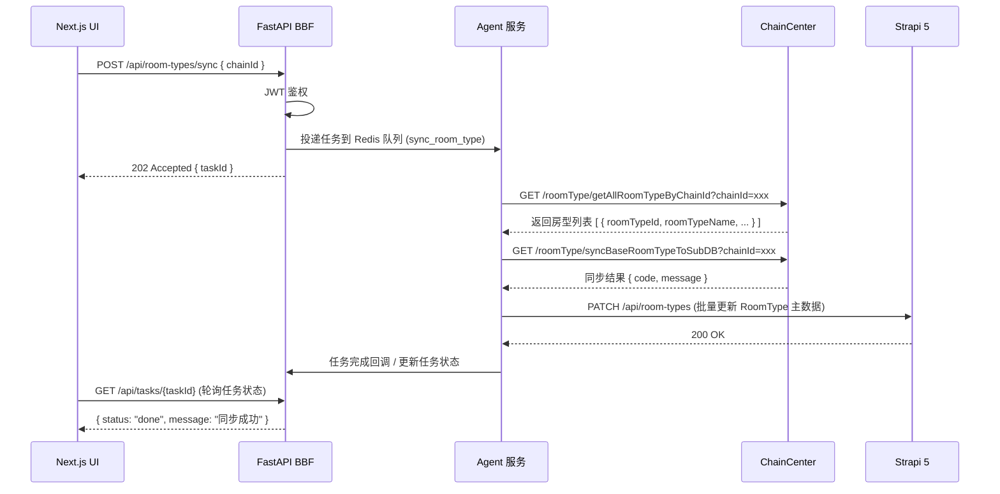

# 房间与房型管理

> 文档版本：v0.1 | 最后更新：2026-04-25 | 负责 Agent：Hawkeye

## 概述

房间与房型管理模块负责酒店物理房间的全生命周期管理，以及房型数据在主系统与分库之间的同步。运维人员可通过该模块完成房间的新增、删除、房型变更，以及将 ChainCenter 的标准房型同步至门店分库。

新系统将 legacy 系统中直接调用 OpsService 的同步操作改造为：简单 CRUD 写入 Strapi，复杂/批量操作通过 Agent 服务异步执行，提升系统可靠性并解耦外部依赖。

---

## 功能说明

> 本节面向运维团队

### 功能列表

**房间管理**

| 分类 | 功能 | 说明 |
|------|------|------|
| 房间管理 | 查看房间列表 | 按酒店（chainId）展示全部房间及其房型、楼层信息 |
| 房间管理 | 新增房间（单个） | 填写房间号、房型、楼层，提交后写入 OpsService |
| 房间管理 | 批量新增房间 | 填写多个房间号（逗号分隔）、统一房型、楼层，批量写入 |
| 房间管理 | 删除房间（单个） | 按房间号删除指定房间 |
| 房间管理 | 批量删除房间 | 一次提交多个房间号进行批量删除 |
| 房间管理 | 修复房态 | 针对房态异常的房间执行修复，恢复正常状态 |

**房型管理**

| 分类 | 功能 | 说明 |
|------|------|------|
| 房型管理 | 查询房型名称 | 按 chainId 从 ChainCenter 获取可用房型列表 |
| 房型管理 | 修改单个房间的房型 | 将指定房间关联到新房型 |
| 房型管理 | 批量修改房型 | 一次提交多个房间号，统一变更为指定房型 |
| 房型管理 | 同步房型到分库 | 将 ChainCenter 基础房型数据下推至酒店分库，确保门店房型与主数据一致 |

### 操作流程

**批量新增房间（重点流程）**

1. 在房间管理页面，选择目标酒店（系统自动带入 chainId）。
2. 在"房间号"输入框中填写需要新增的房间号，多个房间号之间用**英文逗号**分隔，例如：`1001,1002,1003`。房间号须为 4 位数字。
3. 在房型下拉框中选择对应房型（列表从 ChainCenter 动态加载）。
4. 填写楼层编号（整数）。
5. 点击"提交"，系统将请求发送至 BBF，BBF 转发给 Strapi 存储，并异步触发 Agent 调用 OpsService 完成实际写入。
6. 操作结果以成功/失败消息形式反馈给操作人员。

**同步房型到分库流程**

1. 在房型管理页面，确认目标酒店。
2. 点击"同步房型"按钮。
3. BBF 将同步任务投递至 Redis 队列。
4. Agent 服务消费任务，调用 ChainCenter 的同步接口，将基础房型批量写入 Strapi RoomType，并通知 OpsService 更新分库。
5. 同步完成后，操作人员可刷新房型列表查看最新数据。

### 注意事项

- 房间号**必须为 4 位数字**（如 `1001`），不得包含字母或特殊字符。
- 批量操作时，多个房间号使用**英文逗号**分隔（新系统统一标准，不再支持用户自定义分隔符）。
- 同步房型操作为异步执行，提交后需等待片刻再查看结果，切勿重复点击。
- 修复房态功能适用于以下场景：房间状态与实际不符（如已退房但系统显示占用）、批量操作后出现状态残留、人工核查后发现房态数据异常。该操作不可逆，执行前须确认目标酒店。
- 批量删除房间操作不可撤销，执行前请仔细核对房间号列表。

---

## 技术设计

> 本节面向开发团队

### 组件职责

| 组件 | 职责 |
|------|------|
| Next.js UI | 渲染房间列表、新增/删除/房型变更表单，展示操作结果 |
| FastAPI BBF | 接收前端请求，进行 JWT 鉴权，转发至 Strapi 或将任务投递至 Redis 队列 |
| Strapi 5 | 持久化房间（Room）及房型（RoomType）主数据，提供标准 CRUD API |
| Agent 服务 | 消费 Redis 队列任务，调用 OpsService/ChainCenter 执行实际操作，结果回写 Strapi |
| OpsService | 提供房间 CRUD 的底层接口（外部服务） |
| ChainCenter | 提供房型查询与同步接口（外部服务） |

### 关键接口 / API

新系统 BBF 对外暴露的 REST 接口：

| 方法 | 路径 | 处理方式 | 说明 |
|------|------|---------|------|
| GET | `/api/rooms?chainId={id}` | 同步（BBF → Strapi） | 查询酒店房间列表 |
| POST | `/api/rooms` | 同步（BBF → Strapi → OpsService） | 新增单个房间 |
| POST | `/api/rooms/batch` | 异步（BBF → Redis → Agent） | 批量新增房间 |
| DELETE | `/api/rooms/{roomNo}?chainId={id}` | 同步（BBF → Strapi → OpsService） | 删除单个房间 |
| POST | `/api/rooms/batch-delete` | 异步（BBF → Redis → Agent） | 批量删除房间 |
| PATCH | `/api/rooms/{roomNo}/room-type` | 同步（BBF → Strapi → OpsService） | 修改单个房间房型 |
| POST | `/api/rooms/batch-update-room-type` | 异步（BBF → Redis → Agent） | 批量修改房型 |
| POST | `/api/room-types/sync` | 异步（BBF → Redis → Agent） | 触发房型同步到分库 |
| GET | `/api/room-types?chainId={id}` | 同步（BBF → ChainCenter） | 查询可用房型列表 |

**批量操作 API 设计**

批量新增房间请求体示例：

```json
{
  "chainId": 1234,
  "roomNos": ["1001", "1002", "1003"],
  "roomTypeId": 5,
  "floor": 10
}
```

批量删除请求体示例：

```json
{
  "chainId": 1234,
  "roomNos": ["1001", "1002", "1003"]
}
```

批量修改房型请求体示例：

```json
{
  "chainId": 1234,
  "roomNos": ["1001", "1002", "1003"],
  "roomTypeId": 5
}
```

新系统统一改用 JSON array 传递多个房间号，不再使用字符串拼接加分隔符的方式。

### 数据流

**房型同步流程：**



**修复房态：**

- Legacy 系统直接执行 SQL 存储过程 `p_r_RepairRoomStatus`，通过 `@nChainID` 参数定位目标酒店，在数据库层修正房态数据。
- 新系统：通过 Agent 服务执行房态检查和修复逻辑（具体实现待定），不再直接操作数据库，改为调用 OpsService 相关接口或在 Agent 内部实现状态核对与修正逻辑。

### 依赖的外部服务

| 服务 | 接口 | 说明 |
|------|------|------|
| OpsService | `GET /hotel/getRoomList.do?chainId={id}` | 查询酒店房间列表 |
| OpsService | `POST /hotel/addRoom.do` | 新增房间（支持批量，逗号分隔的 roomNos） |
| OpsService | `GET /hotel/deleteRoom.do?chainId={id}&roomNos={nos}` | 删除房间（支持批量） |
| OpsService | `POST /hotel/updateRoomType.do` | 修改房间房型（支持批量） |
| ChainCenter | `GET /roomType/getAllRoomTypeByChainId?chainId={id}` | 按 chainId 查询全部房型 |
| ChainCenter | `GET /roomType/syncBaseRoomTypeToSubDB?chainId={id}` | 将基础房型同步至门店分库 |

---

## 与其他模块的关系

- **酒店管理模块**：房间管理依赖酒店（Chain）数据，chainId 由酒店管理模块维护，房间列表页通过 chainId 关联展示。
- **权限模块**：新增房间、批量删除、同步房型等写操作需要登录鉴权（对应 legacy 的 `[Login]` 过滤器），BBF 层统一校验 JWT。
- **任务中心（Agent）**：所有异步批量操作（批量新增、批量删除、批量修改房型、同步房型）均通过 Agent 服务的任务队列执行，任务状态可在任务中心查询。

---

## 与 Legacy 系统的主要差异

| 维度 | Legacy 系统 | 新系统 |
|------|------------|--------|
| 批量操作参数格式 | 字符串 `"1001,1002,1003"`，分隔符由用户在表单中手动填写 | JSON array `["1001", "1002", "1003"]`，无需分隔符，由前端统一处理 |
| 数据持久化 | 直接调用 OpsService HTTP 接口，无本地持久化 | 先写入 Strapi（主数据），再由 Agent 异步同步至 OpsService |
| 同步方式 | 直接同步 HTTP 调用 OpsService / ChainCenter，阻塞等待结果 | 简单 CRUD 同步写 Strapi；复杂/批量操作异步投递 Redis 队列，Agent 消费执行 |
| 房型同步 | Controller 直接调用 ChainCenter HTTP 接口，结果即时返回 | BBF 投递任务，Agent 调用 ChainCenter 并批量更新 Strapi RoomType，前端轮询任务状态 |
| 修复房态 | 直接执行 SQL 存储过程 `p_r_RepairRoomStatus` | Agent 服务执行房态检查和修复逻辑（具体实现待定） |
| 分隔符 | 用户在表单中指定任意分隔符（空格、逗号、分号等均可） | 统一为英文逗号，前端固定规范，后端接收 JSON array |
