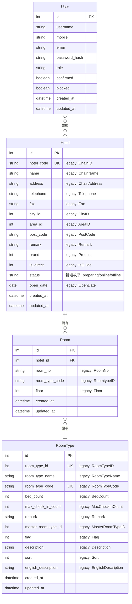

# 数据模型

> 文档版本：v0.1 | 最后更新：2026-04-25 | 负责 Agent：Black Panther

## 概述

本文档描述 ops-ng 系统的数据模型设计，包括各核心实体的字段定义、表关系、索引策略，以及与 legacy 系统的对比说明。

ops-ng 采用统一 PostgreSQL 数据库，通过 Strapi 5 内置 ORM 管理所有业务数据，取代 legacy 系统中分散于 AutoDB、FO 分库、CC 库、BI 库的多数据库架构。

---

## 功能说明

> 本节面向运维团队

### 功能列表

| 功能 | 说明 |
|------|------|
| 酒店信息管理 | 维护酒店基础信息，包括名称、地址、联系方式、品牌类型等 |
| 房间管理 | 维护各酒店的具体房间信息，关联房型 |
| 房型管理 | 维护全局房型配置，供各酒店的房间引用 |
| 用户管理 | 维护系统操作用户的账号、角色和权限 |

### 主要数据实体

| 实体 | 对应表 | 存储内容 | 数据维护方 |
|------|--------|---------|-----------|
| Hotel（酒店） | `hotels` | 酒店名称、地址、电话、传真、城市、区域、邮编、品牌、营业日期等 | 运营团队通过 Strapi Admin 维护 |
| Room（房间） | `rooms` | 房间号、楼层、所属酒店、房型编码等 | 各酒店运维人员通过 API 同步 |
| RoomType（房型） | `room_types` | 房型名称、编码、床位数、最大入住人数、描述等 | 运营团队统一配置 |
| User（用户） | `up_users`（Strapi 内置） | 用户名、手机号、邮箱、角色等 | 系统管理员通过 Strapi Admin 管理 |

### 操作流程

1. **酒店入网**：在 Strapi Admin 创建 Hotel 记录，填写酒店基础信息，设置 `status` 为 `preparing`（准备中）。
2. **房型配置**：在 RoomType 表配置全局房型，各酒店的房间通过 `room_type_code` 引用。
3. **房间导入**：通过 Agent 服务批量导入各酒店房间数据，写入 Room 表并关联 Hotel。
4. **用户授权**：在 Strapi Admin 创建用户账号，分配角色（如酒店管理员、运维人员）。
5. **上线切换**：将 Hotel 的 `status` 更新为 `online`（正式上线）。

### 注意事项

- **数据备份**：所有数据统一存储于 PostgreSQL，采用每日全量备份 + WAL 归档增量备份策略，RTO 目标 < 1 小时，RPO 目标 < 5 分钟。
- **数据迁移**：legacy 数据迁移由 Agent 服务负责，迁移完成前不得删除 legacy 系统数据。
- **权限隔离**：Strapi 通过角色权限控制各团队的数据访问范围，酒店用户仅可访问本酒店数据。

---

## 技术设计

> 本节面向开发团队

### 组件职责

| 组件 | 职责 |
|------|------|
| Strapi 5 | 定义 Content Types（Hotel / Room / RoomType），自动生成 REST/GraphQL CRUD API，管理用户和权限 |
| PostgreSQL | 持久化存储所有业务数据，由 Strapi ORM 管理 Schema 迁移 |
| Agent 服务 | 从 legacy FO 分库批量拉取 Room / RoomType 数据，通过 Strapi HTTP API 写入 PostgreSQL |
| FastAPI BBF | 对外暴露统一 API，转发数据查询请求至 Strapi |

### 关键接口 / API

以下为 Strapi 5 自动生成的核心 REST 接口：

| 方法 | 路径 | 说明 |
|------|------|------|
| GET | `/api/hotels` | 获取酒店列表，支持过滤、分页 |
| GET | `/api/hotels/:id` | 获取单个酒店详情 |
| POST | `/api/hotels` | 创建酒店 |
| PUT | `/api/hotels/:id` | 更新酒店信息 |
| GET | `/api/rooms?filters[hotel][id][$eq]=:hotelId` | 获取指定酒店的房间列表 |
| GET | `/api/room-types` | 获取全部房型 |
| GET | `/api/users/me` | 获取当前用户信息（Strapi Users & Permissions 插件） |

### 数据流

### Hotel 表（对照 legacy c_chain）

| 字段名 | 类型 | 必填 | 说明 |
|--------|------|:----:|------|
| `id` | integer | 是 | 主键，自增（Strapi 内置） |
| `hotel_code` | varchar(50) | 是 | 酒店唯一编码，对应 legacy `ChainID`，迁移时保留原值 |
| `name` | varchar(255) | 是 | 酒店名称，对应 legacy `ChainName` |
| `address` | varchar(256) | 否 | 酒店地址，对应 legacy `ChainAddress` |
| `telephone` | varchar(100) | 否 | 电话，对应 legacy `Telephone` |
| `fax` | varchar(20) | 否 | 传真，对应 legacy `Fax` |
| `city_id` | integer | 否 | 城市 ID，对应 legacy `CityID` |
| `area_id` | integer | 否 | 区域 ID，对应 legacy `AreaID` |
| `post_code` | varchar(100) | 否 | 邮编，对应 legacy `PostCode` |
| `remark` | text | 否 | 备注，对应 legacy `Remark` |
| `brand` | integer | 否 | 品牌类型，对应 legacy `Product`（1:亚朵酒店 2:亚朵精选 3:亚朵轻居 4:有遇） |
| `is_direct` | boolean | 否 | 是否直营，对应 legacy `IsGuide`（1:直营 0:特许） |
| `status` | varchar(20) | 是 | 酒店状态，枚举值：`preparing`/`online`/`offline`；对应 legacy `Status`（1-4），改为语义化枚举 |
| `open_date` | date | 否 | 开业日期，对应 legacy `OpenDate` |
| `created_at` | timestamptz | 是 | 创建时间（Strapi 内置） |
| `updated_at` | timestamptz | 是 | 更新时间（Strapi 内置） |
| ~~`db_name`~~ | ~~varchar~~ | — | **废弃**，对应 legacy `DBName`，新系统统一 PostgreSQL 无需区分分库 |
| ~~`instance`~~ | ~~varchar~~ | — | **废弃**，对应 legacy `Instance`，新系统无 FO 分库实例概念 |
| ~~`step`~~ | ~~integer~~ | — | **废弃**，对应 legacy `Step`，新系统开通流程由 Agent 工作流状态机管理，不再用数字字段表示步骤 |

### Room 表（对照 legacy r_Room/FoRoom）

| 字段名 | 类型 | 必填 | 说明 |
|--------|------|:----:|------|
| `id` | integer | 是 | 主键，自增（Strapi 内置） |
| `hotel_id` | integer | 是 | 外键，关联 Hotel.id，对应 legacy `FoRoom` 通过分库隐式关联酒店 |
| `room_no` | varchar(50) | 是 | 房间号，对应 legacy `RoomNo` |
| `room_type_code` | varchar(50) | 否 | 房型编码，关联 RoomType，对应 legacy `RoomtypeID` |
| `floor` | integer | 否 | 楼层，对应 legacy `Floor` |
| `created_at` | timestamptz | 是 | 创建时间（Strapi 内置） |
| `updated_at` | timestamptz | 是 | 更新时间（Strapi 内置） |

### RoomType 表（对照 legacy r_RoomType）

| 字段名 | 类型 | 必填 | 说明 |
|--------|------|:----:|------|
| `id` | integer | 是 | 主键，自增（Strapi 内置） |
| `room_type_id` | integer | 是 | legacy 房型 ID，对应 legacy `RoomTypeID`，迁移时保留原值，唯一索引 |
| `room_type_name` | varchar(255) | 是 | 房型名称，对应 legacy `RoomTypeName` |
| `room_type_code` | varchar(50) | 是 | 房型编码，对应 legacy `RoomTypeCode`，唯一索引 |
| `bed_count` | integer | 否 | 床位数，对应 legacy `BedCount` |
| `max_check_in_count` | integer | 否 | 最大入住人数，对应 legacy `MaxCheckInCount` |
| `remark` | text | 否 | 备注，对应 legacy `Remark` |
| `master_room_type_id` | integer | 否 | 主房型 ID，对应 legacy `MasterRoomTypeID` |
| `flag` | integer | 否 | 标志位，对应 legacy `Flag` |
| `description` | text | 否 | 房型描述（中文），对应 legacy `Description` |
| `sort` | integer | 否 | 排序，对应 legacy `Sort` |
| `english_description` | text | 否 | 房型描述（英文），对应 legacy `EnglishDescription` |
| `created_at` | timestamptz | 是 | 创建时间（Strapi 内置） |
| `updated_at` | timestamptz | 是 | 更新时间（Strapi 内置） |

### User 表（Strapi 内置 up_users）

| 字段名 | 类型 | 说明 |
|--------|------|------|
| `id` | integer | 主键，自增 |
| `username` | varchar(255) | 用户名，唯一 |
| `mobile` | varchar(50) | 手机号，用于登录（扩展字段） |
| `email` | varchar(255) | 邮箱，唯一 |
| `password` | varchar(255) | 加密后的密码哈希（bcrypt） |
| `role` | integer (FK) | 关联 Strapi 角色表（up_roles），如 admin / hotel_operator / viewer |
| `confirmed` | boolean | 账号是否已验证 |
| `blocked` | boolean | 账号是否已封禁 |
| `created_at` | timestamptz | 创建时间 |
| `updated_at` | timestamptz | 更新时间 |

### 索引策略

| 表 | 索引字段 | 索引类型 | 原因 |
|----|---------|---------|------|
| `hotels` | `hotel_code` | UNIQUE | 酒店编码全局唯一，是数据迁移和对接 legacy 的关键查找键 |
| `hotels` | `status` | B-Tree | 运营按状态筛选酒店（上线/未上线）是高频操作 |
| `rooms` | `hotel_id` | B-Tree | 按酒店查询房间是最高频查询场景，必须有索引 |
| `rooms` | `(hotel_id, room_no)` | UNIQUE | 同一酒店内房间号唯一，防止重复导入 |
| `rooms` | `room_type_code` | B-Tree | 按房型查询房间，Agent 迁移和统计时高频使用 |
| `room_types` | `room_type_code` | UNIQUE | 房型编码全局唯一，Room 表通过此字段关联 |
| `room_types` | `room_type_id` | UNIQUE | 保留 legacy ID，迁移对照时使用 |
| `up_users` | `mobile` | UNIQUE | 手机号登录，Login App 查询用户时通过手机号匹配 |

### 依赖的外部服务

| 服务 | 用途 | 说明 |
|------|------|------|
| PostgreSQL | 数据持久化 | 统一数据库，Strapi ORM 管理 |
| Redis | 会话缓存 / 任务队列 | 不存储业务数据实体 |
| Legacy AutoDB (SQL Server) | 数据迁移源 | 仅在迁移阶段使用，迁移完成后断开依赖 |
| Legacy FO 分库 (SQL Server) | Room / RoomType 数据迁移源 | 仅在迁移阶段使用 |

---

## 与其他模块的关系

| 模块 | 关系 |
|------|------|
| 身份认证（ORY Hydra + Login App） | Login App 调用 Strapi User API 验证用户凭证，用户数据存储于 `up_users` 表 |
| FastAPI BBF（网关层） | BBF 通过 HTTP 调用 Strapi REST API 读写 Hotel / Room / RoomType 数据 |
| Agent 服务（任务执行） | Agent 负责从 legacy 拉取数据并通过 Strapi API 写入 PostgreSQL；任务执行结果也回写 Strapi |
| 前端 UI（Next.js） | 通过 BBF 间接访问 Strapi 数据，不直接连接数据库 |

---

## 与 Legacy 系统的主要差异

| 维度 | Legacy 系统 | ops-ng 新系统 |
|------|------------|--------------|
| 数据库数量 | 4 个数据库：AutoDB（c_chain/c_room）、FO 分库（r_Room/r_RoomType/s_Chain）、CC 库（sys_Chain）、BI 库（c_Chain） | 1 个数据库：统一 PostgreSQL |
| 跨库操作 | 更改酒店名称需同时更新 `c_chain`、`sys_Chain`（CC库）、`s_Chain`（FO分库）、`c_Chain`（BI库）四张表，代码中多个 SQLHelper 调用 | 单表更新，Strapi ORM 自动处理事务 |
| 分库路由 | FO 分库根据 `DBName` 和 `Instance` 字段动态选择 SQL Server 连接，存在双写迁移状态机（MigrateDBHelper） | 无分库，所有数据在同一 PostgreSQL 实例，无需路由逻辑 |
| 废弃字段 - `DBName` | 存储 FO 分库的数据库名称，用于定位酒店在哪个 SQL Server 实例 | 新系统无 FO 分库，字段废弃 |
| 废弃字段 - `Instance` | 存储 FO 实例别名（对应配置文件 `FOConnID`），用于多实例路由 | 新系统无实例概念，字段废弃 |
| 废弃字段 - `Step` | 用整数（0-10）表示酒店开通的下一步操作（建库、建表、初始化、上线等），与 `Status` 配合使用 | 开通流程由 Agent 服务的 LangGraph 工作流管理，状态机逻辑内聚在 Agent，不再通过数据库字段暴露 |
| ORM / 数据访问 | 手写 SQL + SqlDataReader（ADO.NET），无 ORM，SQL 注入风险（如 `GetChainByChainName` 中字符串拼接） | Strapi 5 内置 ORM，参数化查询，类型安全 |
| Schema 变更 | 手动执行 SQL 脚本变更表结构 | Strapi ORM 迁移，版本化管理 |

