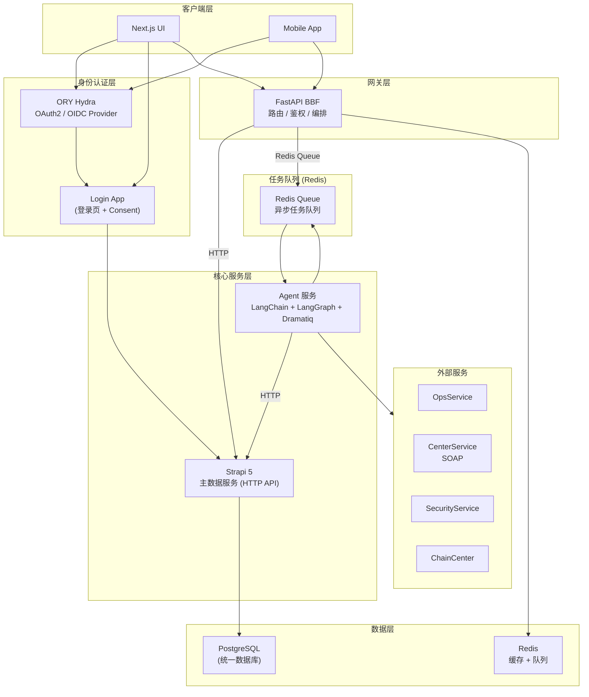
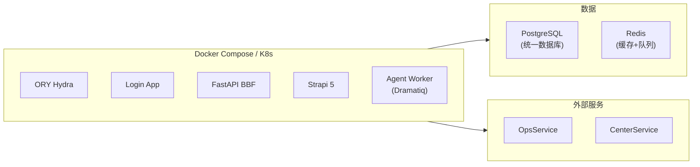

# 系统架构图 v2

## 整体架构



## 组件职责

### 1. ORY Hydra (OAuth2 / OIDC 服务)

- **职责**: OAuth2 / OIDC 授权服务器
- **特点**:
  - 只负责发 Token，不存储用户
  - 标准 OAuth2 / OIDC 实现
  - 支持 PKCE、刷新令牌等
  - 轻量级，Go 编译成单一二进制

- **Endpoints:**
  - `/oauth2/auth` - 授权请求
  - `/oauth2/token` - 获取 Token
  - `/oauth2/userinfo` - 获取用户信息
  - `/oauth2/revoke` - 撤销 Token

- **需要配套:**
  - **Login Provider**: 登录验证逻辑 (Hydra 调用你写的接口验证用户)
  - **Consent Endpoint**: 用户授权确认 (Hydra 调用你写的接口询问用户)

### 2. Login App (登录应用)

- **职责**: 提供登录页面 + 验证用户 + 处理 Consent
- **功能**:
  - 渲染登录表单 (用户名密码 / 手机号 / 邮箱)
  - 调用 Strapi 验证用户凭证
  - 回调 Hydra Consent 确认
  - 可独立部署，与 Hydra 解耦

- **流程:**
  ```
  Hydra 回调 → Login App 渲染登录页 → 用户提交 → Strapi 验证 → 返回 Hydra
  ```

### 3. FastAPI BBF (Backend for Backend)

- **职责**: API 网关 / 服务编排
- **功能**:
  - 请求路由 (→ Strapi / → Agent)
  - Token 验证 (JWT)
  - 服务编排
  - 限流/熔断
  - 日志/监控

### 4. Strapi 5 (主数据服务)

- **职责**: 业务数据管理 + 用户管理
- **功能**:
  - Content Types 定义
  - CRUD API 自动生成
  - **用户管理** (Login App 查询验证)
  - 权限管理
  - 插件扩展

### 5. Agent 服务 (LangChain + LangGraph + Dramatiq)

- **职责**: 后台批量任务执行引擎
- **功能**:
  - 任务编排 (LangGraph)
  - 批量执行 (Dramatiq + Redis 队列)
  - 外部服务调用 (OpsService, CenterService)
  - 任务状态管理

**任务队列流程:**
```
BBF → Dramatiq Task → Redis Queue → Agent Worker
                                      ↓
                           LangGraph 执行工作流
                                      ↓
                           结果回写 → Strapi (HTTP)
```

---

## 认证流程

### OAuth2 授权码流程

```
1. 用户访问 UI，UI 重定向到 Hydra /oauth2/auth
2. Hydra 生成 auth_request，重定向到 Login App /login
3. Login App 渲染登录页
4. 用户提交凭证 (用户名密码)
5. Login App 调用 Strapi 验证用户
6. 验证成功，Login App 回调 Hydra /oauth2/consent
7. Hydra 调用 Consent Endpoint (可简化处理自动授权)
8. Hydra 颁发 Token，重定向回 UI
9. UI 用 Token 访问 BBF API
```

---

## 技术栈

| 组件 | 技术选型 | 说明 |
|------|---------|------|
| OAuth2 | **ORY Hydra** (Go) | 独立 OAuth2 / OIDC 服务 |
| Login App | FastAPI / Next.js | 登录页 + Consent |
| BBF | **FastAPI** | 网关 / 路由 / 鉴权 |
| 主数据 | Strapi 5 + **PostgreSQL** | 内容管理 + 用户管理 |
| Agent | LangChain + LangGraph + Dramatiq | 后台批量任务执行 |
| 任务队列 | Dramatiq + Redis | 异步任务队列 |
| UI | Next.js + shadcn/ui | 前端 |
| 数据库 | **PostgreSQL** (统一) | 所有业务数据 |
| 缓存 | Redis | Session/Token 缓存 |

---

## 部署架构



---

## 决策点

1. **Login App 技术选型**: FastAPI (后端渲染) vs Next.js (前端)
2. **Agent 任务类型**: 具体需要哪些批量任务？
3. **部署方式**: Docker Compose vs Kubernetes
