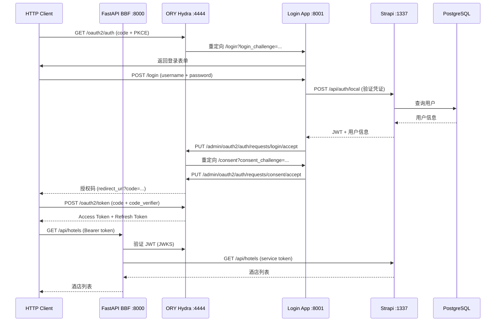

# ops-ng Phase 1 开发设计

**日期**: 2026-04-26
**阶段**: Phase 1 — Strapi + SSO + BBF 基础实现
**版本**: v0.1

---

## 背景

ops-ng 是亚朵集团酒店运维管理系统的下一代版本，取代 legacy .NET 单体应用 AutoDBSystem。Phase 1 实现核心基础设施：SSO 登录流程、主数据服务、API 网关。**不包含 Agent 服务和前端 UI。**

---

## Phase 1 范围

### 包含

- ORY Hydra（OAuth2/OIDC 授权服务器）
- Login App（FastAPI，登录页 + Consent 处理）
- Strapi 5（主数据服务：Hotel/Room/RoomType + 用户管理）
- FastAPI BBF（API 网关：JWT 验证 + 路由代理）
- 基础设施：PostgreSQL 15 + Redis 7（通过 Podman）

### 不包含

- Agent 服务（LangChain + LangGraph + Dramatiq）
- Next.js 前端 UI
- 外部服务集成（OpsService、CenterService、ChainCenter）

---

## 架构设计

### 服务拓扑

```
podman network: ops-ng-net
├── postgres:5432      — 统一数据库（strapi_db + hydra_db 两个 database）
├── redis:6379         — 缓存（Phase 1 预留，BBF session 缓存）
├── hydra:4444         — OAuth2 公开端点（授权、Token 颁发）
├── hydra:4445         — OAuth2 管理端点（内部使用，不对外暴露）
├── login-app:8001     — FastAPI 登录页 + Consent 回调
├── strapi:1337        — 主数据 REST API + 用户管理
└── bbf:8000           — API 网关（唯一对外入口）
```

### 数据流



---

## 开发策略：并行构建 + 合并集成

### Agent 分工

| Agent | 代号 | 负责模块 | 输入依赖 |
|-------|------|---------|---------|
| 主协调 | Nick Fury | podman-compose.yml、API 合同、集成测试 | — |
| Agent 1 | Thor | Strapi 5 初始化 + Content Types + Seed | Postgres ready |
| Agent 2 | Black Widow | ORY Hydra 配置 + Login App (FastAPI) | Hydra + Strapi ready |
| Agent 3 | Iron Man | FastAPI BBF 骨架 + JWT 中间件 + 路由 | Hydra JWKS 可访问 |

### 并行时间线

```
阶段 1（并行）:
  Nick Fury    ── podman-compose.yml + 环境变量模板 ──────────────────
  Thor         ── Strapi init + Schema + Seed ──────────────────────
  Black Widow  ── Hydra config + Login App 开发 ────────────────────
  Iron Man     ── BBF skeleton + mock client 开发 ─────────────────

阶段 2（集成）:
  全员 ── SSO 端到端联调 → BBF 接 Strapi → 全链路冒烟测试 ─────────

阶段 3（测试）:
  全员 ── 单元测试补全 → e2e SSO → API 功能测试 ─────────────────
```

---

## 各服务详细设计

### 1. 基础设施（Nick Fury）

**文件：** `podman-compose.yml`、`.env.example`

**PostgreSQL 配置：**
- 镜像：`postgres:15-alpine`
- 两个 database：`strapi_db`（Strapi 数据）、`hydra_db`（Hydra 状态）
- Volume：`postgres_data:/var/lib/postgresql/data`

**Redis 配置：**
- 镜像：`redis:7-alpine`
- 配置：`appendonly yes`
- Volume：`redis_data:/data`

**环境变量模板（.env.example）：**
```
POSTGRES_USER=ops
POSTGRES_PASSWORD=<secret>
STRAPI_DB=strapi_db
HYDRA_DB=hydra_db
REDIS_URL=redis://redis:6379
HYDRA_PUBLIC_URL=http://hydra:4444
HYDRA_ADMIN_URL=http://hydra:4445
STRAPI_URL=http://strapi:1337
LOGIN_APP_URL=http://login-app:8001
```

---

### 2. Strapi 5（Thor）

**初始化方式：** `npx create-strapi-app@latest strapi --no-run`，选 PostgreSQL 连接

**Content Types（代码定义，位于 `src/api/`）：**

**Hotel：**

| 字段 | 类型 | 说明 |
|------|------|------|
| chainId | Integer | 酒店编码（业务主键，唯一） |
| chainName | String（必填） | 酒店名称 |
| status | Integer | 状态：1-2 未上线，3 正常，4 关闭 |
| step | Integer | 开店步骤 |
| openDate | DateTime | 开业日期 |
| address | String | 酒店地址 |
| telephone | String | 电话 |
| cityId | Integer | 城市 ID |
| areaId | Integer | 区域 ID |
| dbName | String | Legacy 分库名（迁移期保留） |
| instance | String | FO 实例别名（迁移期保留） |

**Room：**

| 字段 | 类型 | 说明 |
|------|------|------|
| roomNo | String（必填） | 房间号 |
| floor | Integer | 楼层 |
| hotel | Relation(Hotel) | 所属酒店（many-to-one） |
| roomType | Relation(RoomType) | 房型（many-to-one） |

**RoomType：**

| 字段 | 类型 | 说明 |
|------|------|------|
| roomTypeCode | String（唯一） | 房型代码 |
| roomTypeName | String | 房型名称 |
| bedCount | Integer | 床位数 |
| maxCheckInCount | Integer | 最大入住人数 |
| sort | Integer | 排序权重 |

**权限配置：**
- BBF service token：Hotel/Room/RoomType 全部 CRUD 权限
- Agent token：RoomType 写权限（Phase 1 预留，暂不使用）
- 公开接口：无

**Seed 脚本（`strapi/src/seeds/`）：**
- 2 个测试酒店（chainId: 1001, 1002）
- 每酒店 5 个房间
- 3 个房型

---

### 3. ORY Hydra + Login App（Black Widow）

**Hydra 配置（环境变量）：**
```
DSN=postgres://ops:<pw>@postgres:5432/hydra_db
URLS_SELF_ISSUER=http://hydra:4444
URLS_CONSENT=http://login-app:8001/consent
URLS_LOGIN=http://login-app:8001/login
URLS_LOGOUT=http://login-app:8001/logout
SECRETS_SYSTEM=<32-char-secret>
```

**OAuth2 Client 注册（启动脚本）：**
```
hydra clients create \
  --id ops-ng-ui \
  --grant-types authorization_code,refresh_token \
  --response-types code \
  --scope openid,offline \
  --callbacks http://localhost:3000/callback \
  --pkce required
```

**Login App（FastAPI）路由：**

| 路由 | 方法 | 说明 |
|------|------|------|
| `/login` | GET | 渲染登录表单，接收 `login_challenge` query 参数 |
| `/login` | POST | 接收账号密码 → 调用 Strapi 验证 → 回调 Hydra accept |
| `/consent` | GET | 自动接受（Phase 1 不显示授权页） |
| `/logout` | GET | 处理 Hydra logout 回调 |
| `/health` | GET | 健康检查 |

**Login App 目录结构：**
```
login-app/
├── main.py              # FastAPI app 入口
├── routers/
│   ├── login.py         # 登录表单 + 凭证验证
│   └── consent.py       # Consent 自动接受
├── services/
│   └── strapi_client.py # 调用 Strapi /api/auth/local
├── templates/
│   └── login.html       # Jinja2 登录表单
├── tests/
│   ├── test_login.py
│   └── test_consent.py
└── requirements.txt
```

---

### 4. FastAPI BBF（Iron Man）

**目录结构：**
```
bbf/
├── main.py              # FastAPI app 入口 + 中间件注册
├── middleware/
│   └── auth.py          # JWT 验证（从 Hydra JWKS 获取公钥）
├── routers/
│   ├── hotels.py        # /api/hotels CRUD
│   └── rooms.py         # /api/hotels/{id}/rooms
├── services/
│   └── strapi_client.py # 代理请求到 Strapi（httpx AsyncClient）
├── models/
│   └── responses.py     # 统一响应模型
├── tests/
│   ├── test_auth.py     # JWT 验证单元测试
│   └── test_hotels.py   # 路由测试（mock Strapi）
└── requirements.txt
```

**Phase 1 路由：**

| 方法 | 路径 | 代理目标 | 说明 |
|------|------|---------|------|
| GET | `/api/hotels` | Strapi `/api/hotels` | 酒店列表，支持分页 |
| GET | `/api/hotels/{id}` | Strapi `/api/hotels/{id}` | 酒店详情 |
| POST | `/api/hotels` | Strapi `/api/hotels` | 新增酒店 |
| PUT | `/api/hotels/{id}` | Strapi `/api/hotels/{id}` | 更新酒店 |
| GET | `/api/hotels/{id}/rooms` | Strapi `/api/rooms?filters[hotel]={id}` | 酒店房间列表 |
| GET | `/health` | — | 健康检查，无需认证 |

**JWT 验证逻辑：**
1. 从请求头提取 `Authorization: Bearer <token>`
2. 从 `http://hydra:4444/.well-known/jwks.json` 获取公钥（缓存 1 小时）
3. 验证 token 签名、有效期、issuer
4. 验证失败返回 `401 {"error": "unauthorized", "code": "INVALID_TOKEN"}`

**统一错误格式：**
```json
{
  "error": "描述信息",
  "code": "ERROR_CODE"
}
```

---

## 测试策略

### 单元测试

| 服务 | 工具 | 关键场景 |
|------|------|---------|
| Login App | pytest + httpx | 凭证验证逻辑、Hydra 回调、表单渲染 |
| BBF | pytest + httpx | JWT 验证（有效/无效/过期）、路由代理（mock Strapi） |
| Strapi | Jest | Content Type 字段验证、API 权限（有 token / 无 token） |

### e2e 测试（Playwright）

**必覆盖场景：**
1. 完整 SSO 登录流程：访问 → 跳转登录页 → 填写凭证 → 获取 Token
2. 携带 Token 访问 BBF → 返回 200 + 数据
3. 无 Token 访问 BBF → 401
4. Token 过期 → 401

### 集成测试（pytest + httpx）

**全链路验证：**
- BBF → Strapi CRUD（携带 service token）
- BBF JWT 验证 → Hydra JWKS（真实网络调用）
- Login App → Strapi 用户验证（真实数据库）

**测试隔离：**
- 测试使用独立 `.env.test`（独立数据库）
- `conftest.py` 负责测试前 seed、测试后 cleanup
- 一键运行：`podman-compose -f podman-compose.test.yml up --abort-on-container-exit`

---

## 项目目录结构

```
ops-ng/
├── podman-compose.yml          # 开发环境
├── podman-compose.test.yml     # 测试环境
├── .env.example                # 环境变量模板
├── strapi/                     # Strapi 5 主数据服务
├── login-app/                  # FastAPI 登录服务
├── bbf/                        # FastAPI BBF 网关
├── doc/                        # 架构文档
├── docs/superpowers/           # 设计文档 + 实施计划
└── legacy/                     # 旧系统（只读参考）
```

---

## 里程碑验收标准

Phase 1 完成的标志：

1. `podman-compose up` 可一键启动所有 6 个服务
2. 使用测试账号完成完整 OAuth2 授权码流程，获取 Access Token
3. 携带 Token 调用 `GET /api/hotels` 返回 seed 数据
4. 无 Token 调用任意 BBF 接口返回 401
5. 所有单元测试通过（pytest + Jest）
6. e2e SSO 流程测试通过（Playwright）
